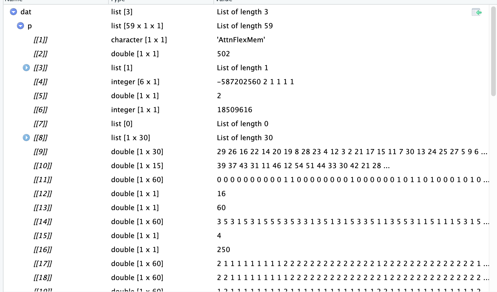
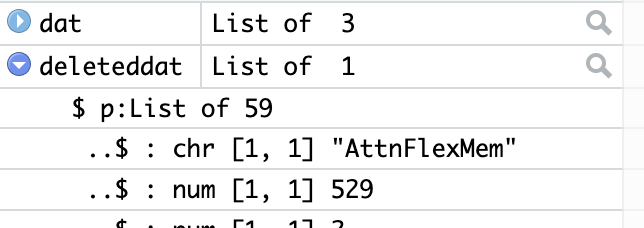
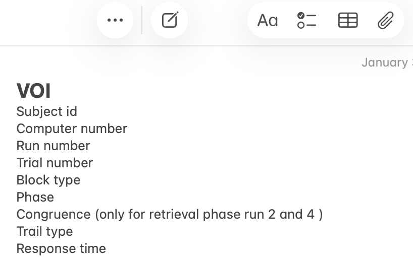

Last semester, I successfully collected data from several participants for my first-year project. However, the current experimental paradigm is not the final version, so I plan to conduct further analyses this semester. The present version is intentionally kept simple. In later stages, I will refine the paradigm, and the code developed in this portfolio will serve as a foundation that can be extended with additional processing steps.

As a first step, I need to extract the raw data. In this portfolio, I focus on organizing these data by extracting variables of interest from Matlab files and converting them into a format that can be read by R, which will facilitate subsequent statistical analyses and data visualization.

## Portfolio goals
+ Understand how data generated in Matlab can interact with R
+ Practice data cleaning and organization in R
+ Extract attention-related results and summarize them into a CSV file


## Intro

The experiment was implemented using Psychtoolbox, so the experimental code was written in Matlab. And as a result, the collected data are stored in Matlab(.mat) structures. In the past, I often performed the following data processing directly in Matlab. However, R offers clear advantages in visualization and many statistical procedures. So, in this class, it is a good opportunity to attempt to migrate part of the Matlab-based workflow into R. This serves as both a practical exercise and an opportunity to better understand how R can efficiently read and handle Matlab-generated data.

More specifically, all participant data are stored in the data folder. Each participant completed four runs (blocks), and each run was saved as a separate .mat file (a Matlab-specific file format, analogous to .rds files in R). When loaded in Matlab, each run produces a *structure* (similar to a folder, or a *list* in R). Within this structure, there are *cell* objects (which resemble nested *list* in R) and *matrix* objects (which are similar to unnamed *tables* in R).


**Before writing any code, it is important to clarify the overall batch-processing strategy.** In my pilot experiment, each participant has two major components of data: attention and memory. The memory component involves more complex extraction steps and additional metric calculations. Therefore, memory-related processing will be deferred to next portfolio :) , at that portfolio I will implement a more comprehensive extraction pipeline
In this portfolio,I plan to as follows:
+ Part 1 focuses on reading Matlab .mat files into R.
+	Part 2 demonstrates the extraction of attention-related data for a single participant.
+	Part 3 wraps these extraction steps into reusable functions.
+	Part 4 applies these functions in a loop to perform batch processing across all participants.

And next portfolio I will do the similar thing and in the end, they will be compilied into a final function, where I can processing *attention* and *memmory* data at a time.


## Part1
First, I need to understand the structure of the Matlab output. The experiment consists of 4 blocks. In each block there is 60 trials and the core task is a key-press task, and we record reaction times for each response. Because reaction time is measured at the trial level, it needs to be aligned with individual trials. For each block, there will be one of the two types of blocks: 

One is the **most-shift** block, in which shifting trials account for 80% with the remaining 20% being hold trials; 

The other is the **most-hold** block, where hold trials account for 80% and shifting trials account for 20%. 

These 4 blocks(runs) are paired into two phases: an **encoding** phase and a **retrieval phase**. Specifically, run 1 corresponds to encoding and run 2 to retrieval, and the same applies to runs 3 and 4. If the **block type** in the encoding phase and the corresponding retrieval phase is the same, we define the pair as **congruent**; otherwise, it is defined as **incongruent**.

So let's begin:

For the first goal is to extract the relevant files. As described in the Introduction, .mat files have a specific internal structure, so the first step is to test whether there are R packages that can read Matlab files and to verify whether the Matlab data structures have corresponding representations in R.

```{r load-packages, warning = FALSE, message=FALSE}
library(tidyverse) 
library(tidyr)
library(R.matlab)
dat <- readMat("testdata/S529Within_run4.mat")
```

According to the help documentation of R.matlab package, Matlab objects are mapped into R as follows:
	•	Matlab struct → R list
	•	Matlab cell → R list
	•	Matlab numeric matrix → R matrix
	•	Matlab logical → R logical

Therefore, after being read into R, a .mat file is represented as a nested list structure. However, when previewing the data, I noticed that the list did not display variable names in the same way as Matlab. Instead, the elements appeared to be stored using numeric indices such as 1, 2, 3, and 4.



The most puzzling part is, intuitively, the ***p*** structure is a 1×60 structure in Matlab and should be mapped to a 1×60 list( well, maybe a better expression is to say a list with 60 elements?) in R. Instead, it appeared as a 1×3 list, where one element was a 1×60 list named ***p***.
<span style="color: deepskyblue;">*(The light-blue sentences is the retrospective remarks from the Holland who have finished the portfolio: keep these weird thing in mind, it reflect a “bug” which bothered me for several days)*</span>


Despite this<span style="color: deepskyblue;">*(It turned out that I paid a price for my reckless use of “despite”！！！)*</span>, I decided to inspect the mapped p object, but I found that the list had no names, So after searching, I know that R had read the object as a three-dimensional list (I had always assumed that lists in R were one-dimensional). So, retrieving the variable names required inspecting the attributes of the three-dimensional p object.
```{r attribute-check, warning = FALSE}
attributes(dat)
attributes(dat$p)
```
From this, we found that p is a 60×1×1 three-dimensional list, and that dimnames[[1]] preserves the original variable names from Matlab. These names correspond perfectly to the original p structure (a retrospective aside: this was genuinely a very satisfying moment).

With this information, we can now correctly access the data values. For example, if we want to know the subject ID stored in this file, it is saved under the variable name PID within p, and we can retrieve it using the following command:
```{r pid-check}
dat$p["PID", 1, 1]
```
Inline code can be written as:
this is subject `r dat$p["PID", 1, 1]`
Everything appears to work perfectly.


By the way, what follows is essentially a record of hard-earned lessons. Everything up to this point appeared to work perfectly. After successfully extracting the PID (the 2nd variable in the structure), I immediately moved on without performing additional checks. This turned out to be a critical mistake.

When R reads Matlab date objects, it does not correctly interpret their internal structure. The *date* variable (the 3rd matrix in ***p***) was split into two components during import (there will be 61 lists). So, what should have been a 60-element structure became misaligned: R assumed there were only 60 elements, shifted all subsequent variables, and pushed the final variable outside the main list, and it also be broken into 2 parts, So this explains why ***dat*** appeared as a list with three elements, one of which called p contained a 60-element sublist, while the remaining elements were fragmented leftovers.

But the most important thing is that, this issue did not affect PID extraction because PID was stored early in the structure. However, once I attempted batch processing, persistent and unexplained errors emerged. After several unsuccessful debugging attempts, I suspected that the issue originated from the R.matlab import process. To ensure reliable downstream analyses, I iterated through all files in Matlab and removed the date variable before re-exporting the data (detailed codes see delete_data.m file). After this correction, the data structure behaved as expected: a single list containing 59 elements.


```{r deleted-date-data, warning = FALSE, message=FALSE}
deleteddat <- readMat("data/S529Within_run4.mat")
```



##Part2

After successfully reading the data, the next step was to extract VOI <span style="color: deepskyblue;">*(I call them as variable of interest)*</span>  related to attention. I writh them down in a memo.


I first tested this process on a single participant before generalizing it into a batch-processing function

```{r load2.1data, warning = FALSE, message=FALSE, results='hide'}
run1 <- readMat("data/S526Within_run1.mat")
run2 <- readMat("data/S526Within_run2.mat")
run3 <- readMat("data/S526Within_run3.mat")
run4 <- readMat("data/S526Within_run4.mat")
```
Next, we attempted to extract several VOIs from run1 and run2 that are independent of the run order
```{r part1-data-check, warning = FALSE, message=FALSE, results='hide'}
run1$p["PID", 1, 1]
run1$p["run", 1, 1]
run1$p["Version", 1, 1] # Bolock Type 1 or 3 means "most shifting". 2 or 4 means "most hold"
run1$p["ShiftCues", 1, 1] # whether shifting cues appear or not. 1 means not appearing (hold); 2 means appearing (shifting).
run1$p[["ResponseTimes", 1, 1]][[2]] #the response time
```
Finally, the congruence variable needs to be determined. If the block types of run1 and run2 are the same, the pair is classified as congruent; otherwise, it is classified as incongruent. So it only for retrieval phase.

At the same time, the indices of the reaction time vector are used as the trial numbers.
```{r attention-extract, warning = FALSE, message=FALSE,results='hide'}
# For encoding phase (run 1,3): congruence = NA
# For retrieval phase (run 2,4): compare with corresponding encoding run
block_type_run1 <- run1$p["Version", 1, 1][[1]]
block_type_run2 <- run2$p["Version", 1, 1][[1]]
block_type_run3 <- run3$p["Version", 1, 1][[1]]
block_type_run4 <- run4$p["Version", 1, 1][[1]]

current_run <- run2$p["run", 1, 1][[1]]
if (current_run %in% c(1, 3)) {
  # Encoding phase is NA
  congruence_value <- NA
} else if (current_run == 2) {
  # Retrieval phase run 2 need to be compared with encoding run 1
  congruence_value <- ifelse((block_type_run1 %in% c(1,3) & block_type_run2 %in% c(1,3)) | 
                              (block_type_run1 %in% c(2,4) & block_type_run2 %in% c(2,4)), 
                            1, 0)
} else if (current_run == 4) {
  # the same with above
  congruence_value <- ifelse((block_type_run3 %in% c(1,3) & block_type_run4 %in% c(1,3)) | 
                              (block_type_run3 %in% c(2,4) & block_type_run4 %in% c(2,4)), 
                            1, 0)
}

# Let's try to extract attention-related data 
attention_run1 <- tibble(
  subid = run1$p["PID", 1, 1][[1]],
  run = current_run,
  trial_number = 1:length(run1$p[["ResponseTimes", 1, 1]][[2]]),
  block_type = block_type_run1,
  congruence = congruence_value,
  trial_type = as.vector(run1$p["ShiftCues", 1, 1][[1]]),
  RT = as.vector(run1$p[["ResponseTimes", 1, 1]][[2]])
)

```
So far so good, we have finished the:

- [x]Subject id
- [x]Run number
- [x]Trial number
- [x]Block type
- [x]Phase
- [x]Congruence (only for retrieval phase run 2 and 4 )
- [x]Trail type
- [x]RT

<span style="color: deepskyblue;"> *I realized that I can use list in Rmarkdown instead of screenshots* </span>,


## Part3
At this point, everything looks good<span style="color: deepskyblue;"> *(this time is ture)* </span>. After successfully extracting the data at the single-participant level, the next step is to turn the existing workflow into a reusable function. Based on the previous code, I made minor modifications and wrapped the extraction procedure into a function.

So, most what I want to say is in the comment in the following code chunck.
```{r function-code}
extract_attention <- function(run1, run2, run3, run4) 
{
  runs <- list(run1, run2, run3, run4)
  # I am trying to process one subject a time, becasue we need all run's data to calculate the"congruence" because it need to be compare, so I made the function run 4 data a time.
  all_attention <- list()

# Only run 2 and 4 are retrieval phase and have the data of congruence. So Using if to judge. 
  for (i in 1:4) 
  {
    run_data <- runs[[i]]
    block_type_current <- run_data$p["Version", 1, 1][[1]]
    current_run <- run_data$p["run", 1, 1][[1]]
    # if run is the class of 1 ,3
    if (current_run %in% c(1, 3)) 
    {
      congruence_value <- NA
    } else if (current_run == 2) 
    {
      block_type_run1 <- run1$p["Version", 1, 1][[1]]
      block_type_run2 <- run2$p["Version", 1, 1][[1]]
      congruence_value <- ifelse((block_type_run1 %in% c(1,3) & block_type_run2 %in% c(1,3)) | 
                                  (block_type_run1 %in% c(2,4) & block_type_run2 %in% c(2,4)), 
                                1, 0)
    } 
    else if (current_run == 4) 
    {
      block_type_run3 <- run3$p["Version", 1, 1][[1]]
      block_type_run4 <- run4$p["Version", 1, 1][[1]]
      congruence_value <- ifelse((block_type_run3 %in% c(1,3) & block_type_run4 %in% c(1,3)) | 
                                  (block_type_run3 %in% c(2,4) & block_type_run4 %in% c(2,4)), 
                                1, 0)
    }
  # Using tibble to assemble  
    all_attention[[i]] <- tibble(
      subid = run_data$p["PID", 1, 1][[1]],
      run = current_run,
      trial_number = 1:length(run_data$p[["ResponseTimes", 1, 1]][[2]]),
      block_type = block_type_current,
      congruence = congruence_value,
      trial_type = as.vector(run_data$p["ShiftCues", 1, 1][[1]]),
      RT = as.vector(run_data$p[["ResponseTimes", 1, 1]][[2]]))
  }
  return(bind_rows(all_attention))
}


```

## Part4
Next, I tested the batch-processing function. The key step here is correctly identifying run1, run2, run3, and run4 for each participant. Fortunately, the Matlab output follows a fixed naming convention. By sorting the filenames, the four runs for each participant can be identified in the correct order. However, it is crucial to sort the files in ascending order; otherwise, the sequence of runs (1, 2, 3, 4) may become scrambled, leading to incorrect pairing across runs.<span style="color: deepskyblue;"> *(actually it is more crucial for memmory part data extraction)* </span>.
```{r Finall-attention-batch}
#Readfiles matching the pattern "Within_run" 
all_files <- list.files("data", pattern = "Within_run.*\\.mat$", full.names = TRUE)
# Sort 
all_files <- sort(all_files)
all_attention <- list()


#Loop through files, grabbing 4 at a time (since each subject has 4 runs)
for (i in seq(1, length(all_files), by = 4)) 
  {
  run1 <- readMat(all_files[i])     
  run2 <- readMat(all_files[i+1])    
  run3 <- readMat(all_files[i+2])      
  run4 <- readMat(all_files[i+3])    
  #Extract attention data for one subejct
  attention_result <- extract_attention(run1, run2, run3, run4)
  #Get the subject ID to used as a key
  subid <- run1$p["PID", 1, 1][[1]]
  all_attention[[subid]] <- attention_result
  }

#Combine data 
attention_data <- bind_rows(all_attention)
# Save data to a CSV 
write.csv(attention_data, "attention_data.csv", row.names = FALSE)

# Take a look 
head(attention_data)

```
Looks good!
So, overall, in this project, We processed `r nrow(attention_data)` trials in total, which equals `r nrow(attention_data) / 60` blocks from `r nrow(attention_data) / 60 / 4` subjects.


<span style="color: deepskyblue;"> Bravo!!! </span>.