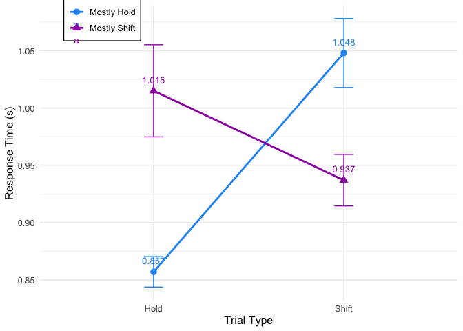
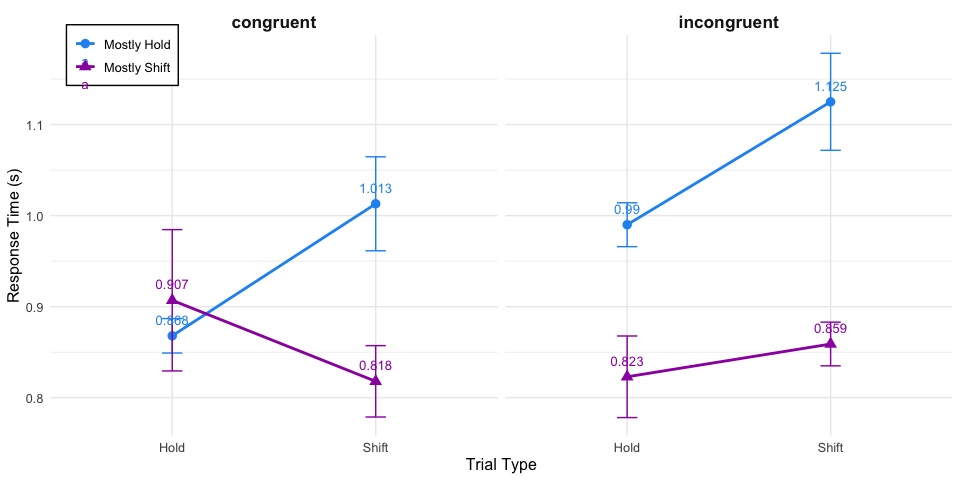
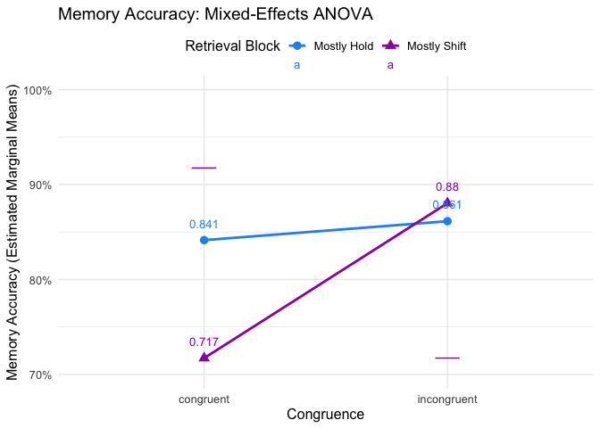

Portfolio 2
================

## Part5: Attention Data Analysis

Now that the attention data has been successfully extracted and saved as
a CSV file, the next step is to perform statistical analyses and
visualize the results. As described in the introduction, each
participant completed multiple trials/blocks, so observations are
correlated within participants. Participants themselves can be seen as a
random sample. Therefore, participants are treated as a random effect to
account for within-participant dependence and to allow individual
differences in baseline levels.

``` r
library(lme4)
library(lmerTest)
library(emmeans)
library(tidyverse) 
library(tidyr)
library(R.matlab)
```

### 5.1 Data Preparation

First, let’s load the attention data and recode variables into
meaningful labels.

``` r
att <- read.csv("attention_data.csv")

# recoding
att$most_condition <- factor(ifelse(att$block_type %in% c(1, 3), "mostly_shift", "mostly_hold"))
att$trial_type <- factor(ifelse(att$trial_type == 2, "shift", "hold"))
att$Congruence <- factor(ifelse(att$congruence == 1, "congruent", "incongruent"))
att$phase <- factor(ifelse(att$run %in% c(1, 3), "encoding", "retrieval"))
att$subject_id <- factor(att$subid)

str(att)
```

    ## 'data.frame':    3120 obs. of  11 variables:
    ##  $ subid         : int  506 506 506 506 506 506 506 506 506 506 ...
    ##  $ run           : int  1 1 1 1 1 1 1 1 1 1 ...
    ##  $ trial_number  : int  1 2 3 4 5 6 7 8 9 10 ...
    ##  $ block_type    : int  1 1 1 1 1 1 1 1 1 1 ...
    ##  $ congruence    : int  NA NA NA NA NA NA NA NA NA NA ...
    ##  $ trial_type    : Factor w/ 2 levels "hold","shift": 2 2 2 1 2 1 2 2 2 2 ...
    ##  $ RT            : num  0 1.44 0 1.29 0 ...
    ##  $ most_condition: Factor w/ 2 levels "mostly_hold",..: 2 2 2 2 2 2 2 2 2 2 ...
    ##  $ Congruence    : Factor w/ 2 levels "congruent","incongruent": NA NA NA NA NA NA NA NA NA NA ...
    ##  $ phase         : Factor w/ 2 levels "encoding","retrieval": 1 1 1 1 1 1 1 1 1 1 ...
    ##  $ subject_id    : Factor w/ 13 levels "506","508","510",..: 1 1 1 1 1 1 1 1 1 1 ...

### 5.2 Encoding Phase Analysis

For the encoding phase, we fit a 2 (most_condition: mostly_shift
vs. mostly_hold) × 2 (trial_type: shift vs. hold) linear mixed-effects
model with participant as random intercept.

``` r
encoding_data <- att %>% filter(phase == "encoding")

# Fit mixed-effects model
encoding_model <- lmer(RT ~ most_condition * trial_type + (1 | subject_id), 
                       data = encoding_data)

summary(encoding_model)$varcor
```

    ##  Groups     Name        Std.Dev.
    ##  subject_id (Intercept) 0.074625
    ##  Residual               0.424789

``` r
anova(encoding_model, type = 3)
```

    ## Type III Analysis of Variance Table with Satterthwaite's method
    ##                           Sum Sq Mean Sq NumDF   DenDF F value    Pr(>F)    
    ## most_condition            0.0576  0.0576     1  288.33  0.3190   0.57265    
    ## trial_type                0.7809  0.7809     1 1544.42  4.3274   0.03767 *  
    ## most_condition:trial_type 4.4021  4.4021     1 1544.42 24.3958 8.695e-07 ***
    ## ---
    ## Signif. codes:  0 '***' 0.001 '**' 0.01 '*' 0.05 '.' 0.1 ' ' 1

A more intuition way to show is :

``` r
encoding_means <- encoding_data %>%
  group_by(most_condition, trial_type) %>%
  summarize(
    mean_RT = round(mean(RT, na.rm = TRUE), 3),
    se_RT = round(sd(RT, na.rm = TRUE) / sqrt(n()), 4),
    n = n(),
    .groups = "drop"
  )
encoding_means
```

    ## # A tibble: 4 × 5
    ##   most_condition trial_type mean_RT  se_RT     n
    ##   <fct>          <fct>        <dbl>  <dbl> <int>
    ## 1 mostly_hold    hold         0.857 0.0133   720
    ## 2 mostly_hold    shift        1.05  0.0301   180
    ## 3 mostly_shift   hold         1.01  0.0402   132
    ## 4 mostly_shift   shift        0.937 0.0225   528

The key finding here is the **most_condition × trial_type interaction**:
Under the mostly_hold condition, there is a large shift cost (shift
trials are much slower than hold trials). However, under the
mostly_shift condition, this difference nearly disappears, as
participants are better adapted to shifting.

``` r
ggplot(encoding_means, aes(x = trial_type, y = mean_RT, 
                            color = most_condition, shape = most_condition, group = most_condition)) +
  geom_point(size = 3) +
  geom_line(linewidth = 1) +
  geom_errorbar(aes(ymin = mean_RT - se_RT, ymax = mean_RT + se_RT), width = 0.1) +
  geom_text(aes(label = mean_RT), vjust = -1.2, size = 3.5) +
  scale_color_manual(values = c("mostly_hold" = "#2196F3", "mostly_shift" = "#9C27B0"),
                     labels = c("Mostly Hold", "Mostly Shift")) +
  scale_shape_manual(values = c("mostly_hold" = 16, "mostly_shift" = 17),
                     labels = c("Mostly Hold", "Mostly Shift")) +
  labs(x = "Trial Type", y = "Response Time (s)", 
       color = NULL, shape = NULL) +
  scale_x_discrete(labels = c("hold" = "Hold", "shift" = "Shift")) +
  theme_minimal() +
  theme(legend.position = c(0.15, 0.95),
        legend.background = element_rect(fill = "white", color = "black"),
        text = element_text(size = 12))
```

<!-- -->

### 5.3 Retrieval Phase Analysis

For the retrieval phase, congruence (whether encoding and retrieval
share the same block type) becomes relevant. So we fit a 2
(most_condition) × 2 (trial_type) × 2 (Congruence) mixed-effects model.

``` r
retrieval_data <- att %>% filter(phase == "retrieval")

# Fit three-way mixed-effects model
retrieval_model <- lmer(RT ~ most_condition * trial_type * Congruence + (1 | subject_id), 
                        data = retrieval_data)

# Random effects
summary(retrieval_model)$varcor
```

    ##  Groups     Name        Std.Dev.
    ##  subject_id (Intercept) 0.15761 
    ##  Residual               0.43633

``` r
# ANOVA table
anova(retrieval_model, type = 3)
```

    ## Type III Analysis of Variance Table with Satterthwaite's method
    ##                                      Sum Sq Mean Sq NumDF  DenDF F value
    ## most_condition                       5.0429  5.0429     1 1476.0 26.4882
    ## trial_type                           0.7785  0.7785     1 1540.0  4.0891
    ## Congruence                           0.7839  0.7839     1 1544.6  4.1177
    ## most_condition:trial_type            1.6864  1.6864     1 1540.0  8.8581
    ## most_condition:Congruence            0.0245  0.0245     1 1031.3  0.1287
    ## trial_type:Congruence                0.2016  0.2016     1 1540.0  1.0591
    ## most_condition:trial_type:Congruence 0.2674  0.2674     1 1540.0  1.4047
    ##                                         Pr(>F)    
    ## most_condition                       3.008e-07 ***
    ## trial_type                            0.043334 *  
    ## Congruence                            0.042608 *  
    ## most_condition:trial_type             0.002963 ** 
    ## most_condition:Congruence             0.719838    
    ## trial_type:Congruence                 0.303593    
    ## most_condition:trial_type:Congruence  0.236125    
    ## ---
    ## Signif. codes:  0 '***' 0.001 '**' 0.01 '*' 0.05 '.' 0.1 ' ' 1

Let’s examine the cell means:

``` r
retrieval_means <- retrieval_data %>%
  group_by(most_condition, trial_type, Congruence) %>%
  summarize(
    mean_RT = round(mean(RT, na.rm = TRUE), 3),
    se_RT = round(sd(RT, na.rm = TRUE) / sqrt(n()), 4),
    n = n(),
    .groups = "drop"
  )
retrieval_means
```

    ## # A tibble: 8 × 6
    ##   most_condition trial_type Congruence  mean_RT  se_RT     n
    ##   <fct>          <fct>      <fct>         <dbl>  <dbl> <int>
    ## 1 mostly_hold    hold       congruent     0.868 0.0189   384
    ## 2 mostly_hold    hold       incongruent   0.99  0.0241   288
    ## 3 mostly_hold    shift      congruent     1.01  0.0516    96
    ## 4 mostly_hold    shift      incongruent   1.12  0.0533    72
    ## 5 mostly_shift   hold       congruent     0.907 0.0776    60
    ## 6 mostly_shift   hold       incongruent   0.823 0.0448    84
    ## 7 mostly_shift   shift      congruent     0.818 0.0392   240
    ## 8 mostly_shift   shift      incongruent   0.859 0.024    336

The retrieval phase yields a significant three-way interaction
(most_condition × trial_type × Congruence). This is an interesting
result. Congruence appears to slightly modulate the magnitude of the
effect under certain conditions. For incongruent trials, participants
actually seem to adapt better to shifting: transitioning from holding to
shifting (or vice versa) appears to make shifting trials themselves more
fluent. This may reflect a form of abstract rule-based attentional
flexibility.

``` r
ggplot(retrieval_means, aes(x = trial_type, y = mean_RT, 
                             color = most_condition, shape = most_condition, group = most_condition)) +
  geom_point(size = 3) +
  geom_line(linewidth = 1) +
  geom_errorbar(aes(ymin = mean_RT - se_RT, ymax = mean_RT + se_RT), width = 0.1) +
  geom_text(aes(label = mean_RT), vjust = -1.2, size = 3.5) +
  facet_wrap(~ Congruence) +
  scale_color_manual(values = c("mostly_hold" = "#2196F3", "mostly_shift" = "#9C27B0"),
                     labels = c("Mostly Hold", "Mostly Shift")) +
  scale_shape_manual(values = c("mostly_hold" = 16, "mostly_shift" = 17),
                     labels = c("Mostly Hold", "Mostly Shift")) +
  labs(x = "Trial Type", y = "Response Time (s)", 
       color = NULL, shape = NULL) +
  scale_x_discrete(labels = c("hold" = "Hold", "shift" = "Shift")) +
  theme_minimal() +
  theme(legend.position = c(0.08, 0.95),
        legend.background = element_rect(fill = "white", color = "black"),
        text = element_text(size = 12),
        strip.text = element_text(size = 13, face = "bold"))
```

<!-- -->

## Part 6: Memory Data Extraction

As mentioned at the beginning, the memory component involves more
complex extraction steps. In this part, I will translate the memory
extraction pipeline from my Matlab code into R. The key idea is: memory
is tested at the **pair level** — run 1 (encoding) pairs with run 2
(retrieval), and run 3 pairs with run 4. During the retrieval run,
participants are tested on items they saw during encoding.

The critical variables to extract from memory data are:

## Memory Data Extraction

However, this memory dataset had several issues during data collection.

- the task scripts were not fully consistent across participants. As a
  result, for the earlier and later portions of the sample, the response
  keys were stored in different cells.

- some participants forgot the instructions and chose to skip trials by
  pressing the space bar.

- in some trials, the location of the correct answer was not stored
  properly.

- the correct answer information was also saved in different places
  depending on the script version. For some participants, it was stored
  in `testorder`, whereas for others it was stored in `testselection`.

- memory extraction differs fundamentally from attention extraction. In
  the attention task, each block can be analyzed independently. In
  contrast, for the memory task, encoding and retrieval do not occur in
  the same block. Therefore, we need to extract two runs simultaneously,
  analyze the retrieval run, and then determine whether each memory
  trial is congruent or incongruent relative to its encoding run.

Therefore, the logic of the memory extraction function is relatively
straightforward. We first read the data from Run 2 and Run 4. Then, we
check whether the second list in `testselection` contains `0`. If it
does, we extract `testorder` from the corresponding 12th or 14th list.
Meanwhile, for `testselection`, we only read the raw key codes as they
were stored. For Run 2, the responses are read from the second list of
`testselection`; for Run 4, they are read from the fourth list. After
that, we record each trial index and which block it belongs to, and then
compute whether each trial is congruent or incongruent.

### 6.1 Memory Extraction Function

<span style="color: deepskyblue;"> This code is extremely complex. I
used GPT to help debug several scenarios, but it still didn’t work. I
had no choice but to add numerous `if` statements. But in fact, I feel
that the time I spend doing this is far more than that of manually
organizing the data. *(Good news is People make mistakes so it worth,
Bad news is Of course people and GPT-written code do too lol)*</span>

``` r
library(R.matlab)
library(dplyr)
library(tibble)

get_p_field <- function(mat_obj, field_name) {
  tryCatch({
    mat_obj$p[field_name, 1, 1][[1]]
  }, error = function(e) NULL)
}

flatten_nested <- function(x) {
  if (is.null(x)) return(NULL)
  if (is.atomic(x)) return(x)
  if (is.list(x)) return(unlist(lapply(x, flatten_nested), recursive = TRUE, use.names = FALSE))
  return(NULL)
}


extract_candidate <- function(x, idx) {
  tryCatch({
    if (is.null(x) || !is.list(x)) return(NULL)
    if (idx > length(x)) return(NULL)
    out <- as.numeric(flatten_nested(x[[idx]]))
    out <- out[!is.na(out)]
    if (length(out) == 0) return(NULL)
    out
  }, error = function(e) NULL)
}

is_valid_order <- function(x) {
  if (is.null(x) || length(x) == 0) return(FALSE)
  x <- x[!is.na(x)]
  if (length(x) == 0) return(FALSE)
  if (any(x == 0)) return(FALSE)
  if (!all(x %in% c(1, 2))) return(FALSE)
  TRUE
}

# 根据 run 和数据结构尝试多个候选位置
choose_testorder <- function(ts, to, ret_run) {
  sel_idx <- ifelse(ret_run == 2, 2,
                    ifelse(ret_run == 4, 4, NA))
  
  if (is.na(sel_idx)) return(NULL)
  
  ts2 <- extract_candidate(ts, 2)
  has_zero_in_second <- !is.null(ts2) && any(ts2 == 0, na.rm = TRUE)
  

  preferred_order_idx <- ifelse(ret_run == 2, 12,
                                ifelse(ret_run == 4, 14, NA))
  
  candidates <- list()
  

  if (has_zero_in_second && !is.na(preferred_order_idx)) {
    candidates[[paste0("to_", preferred_order_idx)]] <- extract_candidate(to, preferred_order_idx)
  }
  
  candidates[[paste0("to_", sel_idx)]] <- extract_candidate(to, sel_idx)
  
  if (!is.na(preferred_order_idx)) {
    candidates[[paste0("ts_", preferred_order_idx)]] <- extract_candidate(ts, preferred_order_idx)
  }

  candidates[[paste0("ts_", sel_idx)]] <- extract_candidate(ts, sel_idx)
  

  for (nm in names(candidates)) {
    cand <- candidates[[nm]]
    if (is_valid_order(cand)) {
      message("Using TestOrder source: ", nm)
      return(cand)
    }
  }
  
  for (nm in names(candidates)) {
    cand <- candidates[[nm]]
    if (!is.null(cand) && length(cand) > 0) {
      cand_clean <- cand[cand %in% c(1, 2)]
      if (length(cand_clean) > 0) {
        message("Fallback TestOrder source: ", nm, " (filtered to 1/2 only)")
        return(cand_clean)
      }
    }
  }
  
  NULL
}

extract_memory_run <- function(p_enc, p_ret, pair_num) {
  
  subject_id  <- suppressWarnings(as.numeric(get_p_field(p_enc, "PID")))
  enc_run     <- suppressWarnings(as.numeric(get_p_field(p_enc, "run")))
  ret_run     <- suppressWarnings(as.numeric(get_p_field(p_ret, "run")))
  enc_version <- suppressWarnings(as.numeric(get_p_field(p_enc, "Version")))
  ret_version <- suppressWarnings(as.numeric(get_p_field(p_ret, "Version")))
  
  enc_block <- ifelse(enc_version %in% c(1, 3), "mostly_shift", "mostly_hold")
  ret_block <- ifelse(ret_version %in% c(1, 3), "mostly_shift", "mostly_hold")
  congruence <- ifelse(enc_version == ret_version, "congruent", "incongruent")
  
  ts <- get_p_field(p_ret, "testselection")
  to <- get_p_field(p_ret, "testorder")
  
  if (is.null(ts) || is.null(to)) return(NULL)
  if (!is.list(ts) || !is.list(to)) return(NULL)
  
  sel_idx <- ifelse(ret_run == 2, 2,
                    ifelse(ret_run == 4, 4, NA))
  if (is.na(sel_idx)) return(NULL)
  

  raw_selection <- extract_candidate(ts, sel_idx)
  if (is.null(raw_selection) || length(raw_selection) == 0) return(NULL)

  raw_testorder <- choose_testorder(ts, to, ret_run)
  if (is.null(raw_testorder) || length(raw_testorder) == 0) return(NULL)
  

  raw_testorder <- raw_testorder[raw_testorder %in% c(1, 2)]
  if (length(raw_testorder) == 0) return(NULL)
  
  n <- min(length(raw_selection), length(raw_testorder))
  raw_selection <- raw_selection[1:n]
  raw_testorder <- raw_testorder[1:n]
  
  tibble(
    SubjectID = subject_id,
    Pair = pair_num,
    EncodingRun = enc_run,
    RetrievalRun = ret_run,
    EncodingBlock = enc_block,
    RetrievalBlock = ret_block,
    Congruence = congruence,
    Trial = seq_len(n),
    TestOrder = raw_testorder,
    Selection = raw_selection
  )
}

extract_memory_subject <- function(run1, run2, run3, run4) {
  pair1 <- extract_memory_run(run1, run2, pair_num = 1)
  pair2 <- extract_memory_run(run3, run4, pair_num = 2)
  bind_rows(pair1, pair2)
}
```

### 6.2 Batch Processing for Memory Data

Similar to the attention batch processing, we loop through all
participants’ files and extract memory data.

``` r
all_files <- list.files("data", pattern = "Within_run.*\\.mat$", full.names = TRUE)
all_files <- sort(all_files)
all_memory <- list()

for (i in seq(1, length(all_files), by = 4)) {
  
  if ((i + 3) > length(all_files)) next
  
  run1 <- tryCatch(readMat(all_files[i]),   error = function(e) NULL)
  run2 <- tryCatch(readMat(all_files[i+1]), error = function(e) NULL)
  run3 <- tryCatch(readMat(all_files[i+2]), error = function(e) NULL)
  run4 <- tryCatch(readMat(all_files[i+3]), error = function(e) NULL)
  
  if (is.null(run1) || is.null(run2) || is.null(run3) || is.null(run4)) next
  
  memory_result <- extract_memory_subject(run1, run2, run3, run4)
  
  if (!is.null(memory_result) && nrow(memory_result) > 0) {
    subid <- suppressWarnings(as.numeric(get_p_field(run1, "PID")))
    all_memory[[as.character(subid)]] <- memory_result
  }
}

memory_data <- bind_rows(all_memory)

write.csv(memory_data, "memory_data.csv", row.names = FALSE)
head(memory_data)
```

    ## # A tibble: 6 × 10
    ##   SubjectID  Pair EncodingRun RetrievalRun EncodingBlock RetrievalBlock
    ##       <dbl> <dbl>       <dbl>        <dbl> <chr>         <chr>         
    ## 1       508     1           1            2 mostly_hold   mostly_hold   
    ## 2       508     1           1            2 mostly_hold   mostly_hold   
    ## 3       508     1           1            2 mostly_hold   mostly_hold   
    ## 4       508     1           1            2 mostly_hold   mostly_hold   
    ## 5       508     1           1            2 mostly_hold   mostly_hold   
    ## 6       508     1           1            2 mostly_hold   mostly_hold   
    ## # ℹ 4 more variables: Congruence <chr>, Trial <int>, TestOrder <dbl>,
    ## #   Selection <dbl>

## Part7: Memory Data Analysis

### 7.1 Accuracy Summary

First, let’s compute per-participant accuracy rates, aggregated by
RetrievalBlock and Congruence.

``` r
memory_data <- memory_data %>%
  mutate(
    Correct = case_when(
      Selection == 66 ~ NA_real_,
      Selection == 53 & TestOrder == 1 ~ 1,
      Selection == 59 & TestOrder == 2 ~ 1,
      TRUE ~ 0
    )
  )

table(memory_data$Correct, useNA = "ifany")
```

    ## 
    ##    0    1 <NA> 
    ##   47  227   56

``` r
memory_data <- memory_data %>%
  mutate(
    SubjectID = factor(SubjectID),
    RetrievalBlock = factor(RetrievalBlock),
    Congruence = factor(Congruence)
  )

# Per-participant accuracy by condition
memory_summary <- memory_data %>%
  group_by(SubjectID) %>%
  filter(!any(is.na(Correct))) %>%
  group_by(SubjectID, RetrievalBlock, Congruence) %>%
  summarise(
    accuracy = mean(Correct), 
    n_trials = n(),
    .groups = "drop"
  )
```

### 7.2 Mixed-Effects ANOVA on Accuracy

I first fit a linear mixed-effects model on the aggregated accuracy
rates.

``` r
library(lme4)
library(lmerTest)

memory_model_agg <- lmer(
  accuracy ~ RetrievalBlock * Congruence + (1 | SubjectID),
  data = memory_summary
)

summary(memory_model_agg)
```

    ## Linear mixed model fit by REML. t-tests use Satterthwaite's method [
    ## lmerModLmerTest]
    ## Formula: accuracy ~ RetrievalBlock * Congruence + (1 | SubjectID)
    ##    Data: memory_summary
    ## 
    ## REML criterion at convergence: -3.9
    ## 
    ## Scaled residuals: 
    ##     Min      1Q  Median      3Q     Max 
    ## -1.1925 -0.4373 -0.0149  0.4649  1.0194 
    ## 
    ## Random effects:
    ##  Groups    Name        Variance Std.Dev.
    ##  SubjectID (Intercept) 0.03094  0.1759  
    ##  Residual              0.01060  0.1030  
    ## Number of obs: 18, groups:  SubjectID, 9
    ## 
    ## Fixed effects:
    ##                                                  Estimate Std. Error       df
    ## (Intercept)                                       0.84145    0.07512 12.30099
    ## RetrievalBlockmostly_shift                       -0.12436    0.09617  8.03486
    ## Congruenceincongruent                             0.02000    0.08657  7.41151
    ## RetrievalBlockmostly_shift:Congruenceincongruent  0.14329    0.13601  8.03486
    ##                                                  t value Pr(>|t|)    
    ## (Intercept)                                       11.201 8.17e-08 ***
    ## RetrievalBlockmostly_shift                        -1.293    0.232    
    ## Congruenceincongruent                              0.231    0.824    
    ## RetrievalBlockmostly_shift:Congruenceincongruent   1.054    0.323    
    ## ---
    ## Signif. codes:  0 '***' 0.001 '**' 0.01 '*' 0.05 '.' 0.1 ' ' 1
    ## 
    ## Correlation of Fixed Effects:
    ##             (Intr) RtrvB_ Cngrnc
    ## RtrvlBlckm_ -0.427              
    ## Cngrncncngr -0.339  0.370       
    ## RtrvlBlc_:C  0.302 -0.707 -0.786

``` r
anova(memory_model_agg, type = 3)
```

    ## Type III Analysis of Variance Table with Satterthwaite's method
    ##                              Sum Sq   Mean Sq NumDF  DenDF F value Pr(>F)
    ## RetrievalBlock            0.0063719 0.0063719     1 8.0349  0.6010 0.4604
    ## Congruence                0.0310292 0.0310292     1 6.5030  2.9268 0.1341
    ## RetrievalBlock:Congruence 0.0117672 0.0117672     1 8.0349  1.1099 0.3227

``` r
library(dplyr)

# Descriptive statistics by condition
memory_desc <- memory_summary %>%
  group_by(RetrievalBlock, Congruence) %>%
  summarise(
    mean_accuracy = mean(accuracy, na.rm = TRUE),
    sd_accuracy = sd(accuracy, na.rm = TRUE),
    n_subjects = n(),
    .groups = "drop"
  )

memory_desc
```

    ## # A tibble: 4 × 5
    ##   RetrievalBlock Congruence  mean_accuracy sd_accuracy n_subjects
    ##   <fct>          <fct>               <dbl>       <dbl>      <int>
    ## 1 mostly_hold    congruent           0.811      0.233           6
    ## 2 mostly_hold    incongruent         0.911      0.0770          3
    ## 3 mostly_shift   congruent           0.778      0.139           3
    ## 4 mostly_shift   incongruent         0.856      0.236           6

### 7.3 Memory Accuracy Visualization

``` r
library(emmeans)
library(ggplot2)

# Estimated marginal means
memory_emm <- emmeans(memory_model_agg, ~ RetrievalBlock * Congruence)
memory_emm_df <- as.data.frame(memory_emm)

ggplot(memory_emm_df,
       aes(x = Congruence,
           y = emmean,
           color = RetrievalBlock,
           shape = RetrievalBlock,
           group = RetrievalBlock)) +
  geom_point(size = 3) +
  geom_line(linewidth = 1) +
  geom_errorbar(aes(ymin = lower.CL, ymax = upper.CL), width = 0.1) +
  geom_text(aes(label = round(emmean, 3)), vjust = -1.5, size = 3.5) +
  scale_color_manual(
    values = c("mostly_hold" = "#2196F3", "mostly_shift" = "#9C27B0"),
    labels = c("Mostly Hold", "Mostly Shift")
  ) +
  scale_shape_manual(
    values = c("mostly_hold" = 16, "mostly_shift" = 17),
    labels = c("Mostly Hold", "Mostly Shift")
  ) +
  scale_y_continuous(
    labels = scales::percent_format(),
    limits = c(0.7, 1.0)
  ) +
  labs(
    x = "Congruence",
    y = "Memory Accuracy (Estimated Marginal Means)",
    title = "Memory Accuracy: Mixed-Effects ANOVA",
    color = "Retrieval Block",
    shape = "Retrieval Block"
  ) +
  theme_minimal() +
  theme(
    text = element_text(size = 12),
    legend.position = "top"
  )
```

<!-- -->
