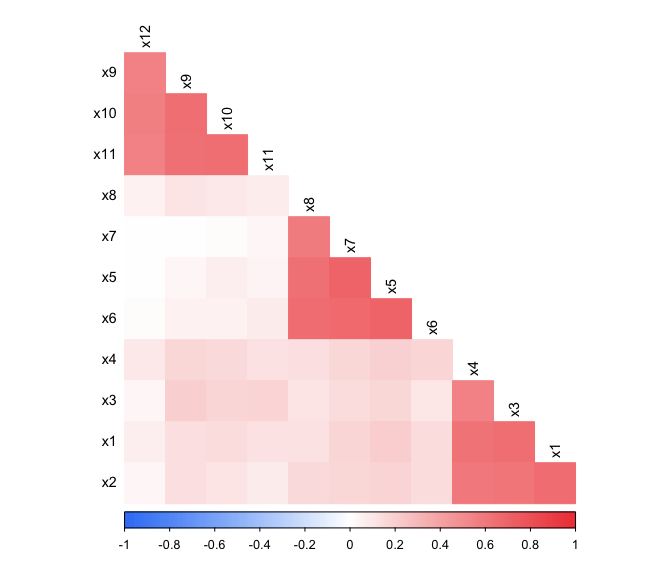
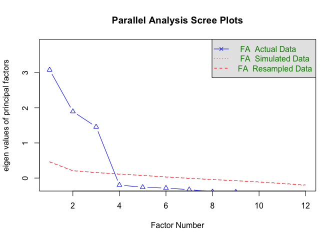
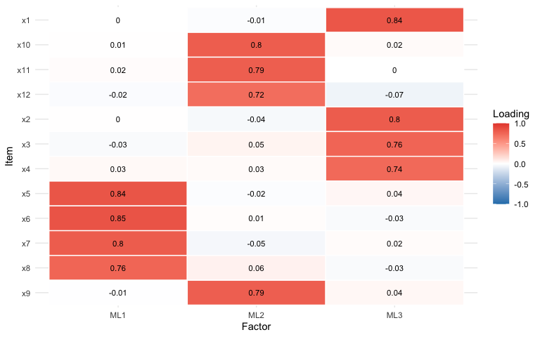
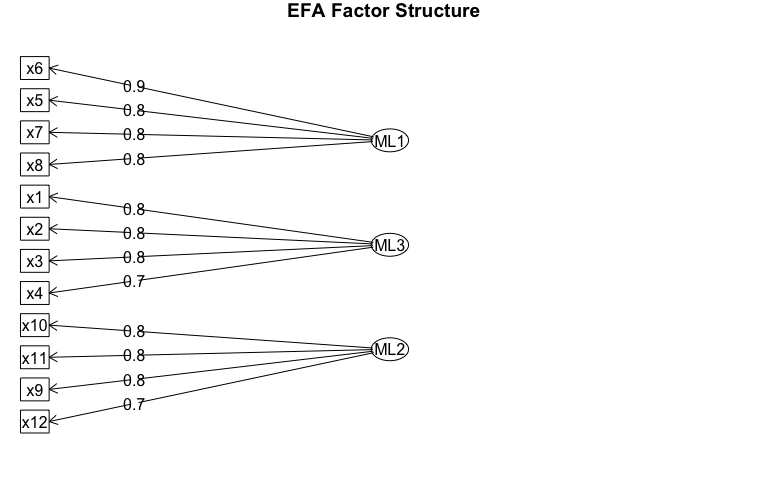
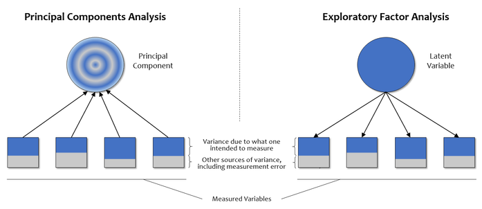
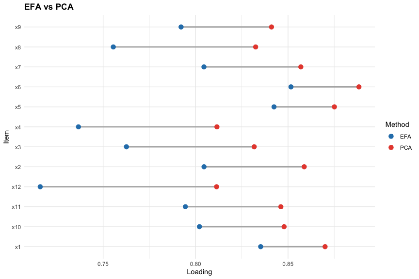
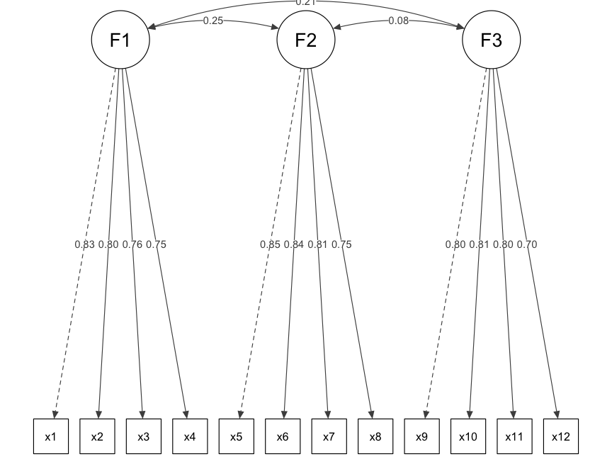
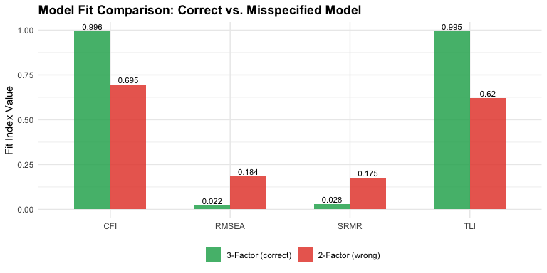

Portfolio7
================
Holland Sun

In many research studies involving questionnaire development, It is hard
to avoid talking about the exploratory (EFA) and confirmatory (CFA)
factor analysis. But most of the time I just look at tables of factor
loadings in spss. This portfolio is a quick exercise in doing both EFA
and CFA in R and also trying to do some visulaztion.

## Portfolio Goals

- Simulate data
- Run EFA to “discover” the structure from the data
- Run CFA to confirm it
- Visualize the results

``` r
library(tidyverse)
library(lavaan)
library(psych)
library(semPlot)
library(corrplot)
```

## Part 1: Setup and Data Simulation

I’ll simulate data with 3 latent factors, each measured by 4 items. The
nice thing about simulated data is we know the population distribution,
so we can check whether EFA and CFA recover it correctly.

``` r
set.seed(42)
n <- 500

# 3 latent factors
F1 <- rnorm(n)
F2 <- rnorm(n)
F3 <- rnorm(n)

F2 <- 0.3 * F1 + sqrt(1 - 0.3^2) * F2
F3 <- 0.2 * F1 + sqrt(1 - 0.2^2) * F3

dat <- tibble(
  x1 = 0.75*F1 + rnorm(n, sd = 0.5),
  x2 = 0.70*F1 + rnorm(n, sd = 0.5),
  x3 = 0.65*F1 + rnorm(n, sd = 0.5),
  x4 = 0.60*F1 + rnorm(n, sd = 0.5),
  x5 = 0.80*F2 + rnorm(n, sd = 0.5),
  x6 = 0.70*F2 + rnorm(n, sd = 0.5),
  x7 = 0.65*F2 + rnorm(n, sd = 0.5),
  x8 = 0.55*F2 + rnorm(n, sd = 0.5),
  x9 = 0.75*F3 + rnorm(n, sd = 0.5),
  x10 = 0.70*F3 + rnorm(n, sd = 0.5),
  x11 = 0.60*F3 + rnorm(n, sd = 0.5),
  x12 = 0.50*F3 + rnorm(n, sd = 0.5)
)

cat("Simulated:", n, "observations,", ncol(dat), "items\n")
```

    ## Simulated: 500 observations, 12 items

### 1.1 Correlation matrix

Before doing any factor analysis, it is useful to look at the
correlations. If the factor structure is real, we should see blocks of
higher correlations among items that share a factor.

``` r
cor_mat <- cor(dat)
corrplot(
  cor_mat,
  method = "color",
  type = "lower",
  order = "hclust",
  diag = FALSE,
  tl.col = "black",
  tl.cex = 0.9,
  col = colorRampPalette(c("#3B82F6", "white", "#EF4444"))(200),
  addCoef.col = NULL,
  mar = c(0, 0, 1, 0)
)
```

<!-- -->

It’s more intuitive to use a corr diagram rather than looking at a
table, especially if those analysis with lots of item. And it is easy to
find there seems to be 3 block: x1-x4, x5-x8, x9-x12. That’s a good
signal.

## Part 2: EFA

EFA doesn’t assume any structure. It looks at the correlations and tries
to find the best set of latent factors to explain them. The key
decisions are: how many factors, and what rotation.

### 2.1 Parallel Analysis

``` r
fa.parallel(dat, fa = "fa")
```

<!-- -->

    ## Parallel analysis suggests that the number of factors =  3  and the number of components =  NA

Parallel analysis compares our data’s with the random noise’s result. It
suggest that we have 3 factors here.

### 2.2 Run EFA

``` r
efa_result <- fa(dat, nfactors = 3, rotate = "oblimin", fm = "ml")
```

    ## Loading required namespace: GPArotation

``` r
print(efa_result, cut = 0.3, sort = TRUE)
```

    ## Factor Analysis using method =  ml
    ## Call: fa(r = dat, nfactors = 3, rotate = "oblimin", fm = "ml")
    ## Standardized loadings (pattern matrix) based upon correlation matrix
    ##     item   ML1   ML3   ML2   h2   u2 com
    ## x6     6  0.85             0.72 0.28   1
    ## x5     5  0.84             0.72 0.28   1
    ## x7     7  0.80             0.65 0.35   1
    ## x8     8  0.76             0.57 0.43   1
    ## x1     1        0.84       0.69 0.31   1
    ## x2     2        0.80       0.64 0.36   1
    ## x3     3        0.76       0.59 0.41   1
    ## x4     4        0.74       0.56 0.44   1
    ## x10   10              0.80 0.65 0.35   1
    ## x11   11              0.79 0.63 0.37   1
    ## x9     9              0.79 0.64 0.36   1
    ## x12   12              0.72 0.50 0.50   1
    ## 
    ##                        ML1  ML3  ML2
    ## SS loadings           2.66 2.48 2.43
    ## Proportion Var        0.22 0.21 0.20
    ## Cumulative Var        0.22 0.43 0.63
    ## Proportion Explained  0.35 0.33 0.32
    ## Cumulative Proportion 0.35 0.68 1.00
    ## 
    ##  With factor correlations of 
    ##      ML1  ML3  ML2
    ## ML1 1.00 0.24 0.07
    ## ML3 0.24 1.00 0.20
    ## ML2 0.07 0.20 1.00
    ## 
    ## Mean item complexity =  1
    ## Test of the hypothesis that 3 factors are sufficient.
    ## 
    ## df null model =  66  with the objective function =  6.01 with Chi Square =  2968.49
    ## df of  the model are 33  and the objective function was  0.08 
    ## 
    ## The root mean square of the residuals (RMSR) is  0.01 
    ## The df corrected root mean square of the residuals is  0.02 
    ## 
    ## The harmonic n.obs is  500 with the empirical chi square  5.87  with prob <  1 
    ## The total n.obs was  500  with Likelihood Chi Square =  38.89  with prob <  0.22 
    ## 
    ## Tucker Lewis Index of factoring reliability =  0.996
    ## RMSEA index =  0.019  and the 90 % confidence intervals are  0 0.039
    ## BIC =  -166.19
    ## Fit based upon off diagonal values = 1
    ## Measures of factor score adequacy             
    ##                                                    ML1  ML3  ML2
    ## Correlation of (regression) scores with factors   0.94 0.92 0.92
    ## Multiple R square of scores with factors          0.88 0.84 0.85
    ## Minimum correlation of possible factor scores     0.75 0.69 0.70

Oblimin rotation allows factors to be correlated, which is realistic for
most psychological constructs. Let’s visualize the loadings.

``` r
loadings_df <- as.data.frame(unclass(efa_result$loadings)) %>%
  rownames_to_column("item") %>%
  pivot_longer(-item, names_to = "factor", values_to = "loading")

ggplot(loadings_df, aes(x = factor, y = fct_rev(item), fill = loading)) +
  geom_tile(color = "white", linewidth = 0.5) +
  geom_text(aes(label = round(loading, 2)), size = 3) +
  scale_fill_gradient2(low = "#2980B9", mid = "white", high = "#E74C3C",
                       midpoint = 0, limits = c(-1, 1)) +
  labs(x = "Factor", y = "Item", fill = "Loading") +
  theme_minimal() +
  theme(plot.title = element_text(face = "bold"))
```

<!-- -->

``` r
fa.diagram(efa_result, main = "EFA Factor Structure")
```

<!-- -->

because we use simulation data here so each item load primarily on its
“true” factor as we set in part1, and also with small cross-loadings on
the other two. The heatmap makes this easy to see that trend.

### 2.3 PCA vs. EFA

For a long time I couldn’t clearly articulate the difference between PCA
(Principal Components Analysis) and EFA (Exploratory Factor Analysis).
They both reduce a bunch of variables down to a smaller set of factors,
and in practice the results often look similar.

**One picture I really like** shows their difference is:



In PCA, the component is a **weighted sum of the observed variables**
the arrows point from the items to the component. PCA tries to capture
as much total variance as possible, including measurement error and
item-specific variance.

In EFA, the latent factor is assumed to **cause** the observed variables
the arrows point from the factor to the items. EFA only tries to explain
the **shared variance** (covariance) among items, and explicitly
separates out unique variance (the blue-white portions in the figure).

I think it will be perfect if this picture also mark the independent
variance of EFA.

<span style="color: deepskyblue;"> An important reason why I am confused
is that in my undergraduate courses, I was first taught how to use SPSS
for EFA, but in reality, SPSS’s default EFA is actually PCA. (I know
that’s really strange) </span>

Let’s run both on the same data and compare:

``` r
# PCA
pca_result <- principal(dat, nfactors = 3, rotate = "oblimin")

# Compare loadings side by side for Factor 1 items
comparison_pca_efa <- tibble(
  item = paste0("x", 1:12),
  PCA_RC1 = as.numeric(pca_result$loadings[, 1]),
  EFA_ML1 = as.numeric(efa_result$loadings[, 1])
)
comparison_pca_efa %>%
  mutate(across(where(is.numeric), ~round(., 3)))
```

    ## # A tibble: 12 × 3
    ##    item  PCA_RC1 EFA_ML1
    ##    <chr>   <dbl>   <dbl>
    ##  1 x1      0.005   0.001
    ##  2 x2      0.007   0.004
    ##  3 x3     -0.033  -0.028
    ##  4 x4      0.025   0.029
    ##  5 x5      0.875   0.842
    ##  6 x6      0.888   0.852
    ##  7 x7      0.857   0.805
    ##  8 x8      0.832   0.755
    ##  9 x9     -0.003  -0.005
    ## 10 x10     0.008   0.006
    ## 11 x11     0.015   0.015
    ## 12 x12    -0.019  -0.019

``` r
# Primary loading for PCA
pca_primary <- as.data.frame(unclass(pca_result$loadings)) %>%
  rownames_to_column("item") %>%
  pivot_longer(-item, names_to = "dimension", values_to = "loading") %>%
  group_by(item) %>%
  slice_max(abs(loading), n = 1, with_ties = FALSE) %>%
  ungroup() %>%
  transmute(item, loading = loading, method = "PCA")

# Primary loading for EFA
efa_primary <- as.data.frame(unclass(efa_result$loadings)) %>%
  rownames_to_column("item") %>%
  pivot_longer(-item, names_to = "dimension", values_to = "loading") %>%
  group_by(item) %>%
  slice_max(abs(loading), n = 1, with_ties = FALSE) %>%
  ungroup() %>%
  transmute(item, loading = loading, method = "EFA")

compare_long <- bind_rows(pca_primary, efa_primary)

compare_wide <- compare_long %>%
  pivot_wider(names_from = method, values_from = loading)

ggplot(compare_wide, aes(y = item)) +
  geom_segment(aes(x = EFA, xend = PCA, yend = item),
               color = "gray70", linewidth = 1) +
  geom_point(data = compare_long,
             aes(x = loading, color = method),
             size = 3) +
  scale_color_manual(values = c("EFA" = "#2980B9", "PCA" = "#E74C3C")) +
  labs(
    title = "EFA vs PCA",
    x = "Loading",
    y = "Item",
    color = "Method"
  ) +
  theme_minimal() +
  theme(plot.title = element_text(face = "bold"))
```

<!-- -->

You can see that PCA loadings are systematically higher than EFA
loadings.This is because PCA includes unique variance in its components,
while EFA separates it out. In practice, if the data has a lot of
measurement error, PCA can be misleading because it inflates the
apparent loading strength. So be caeful.

## Part 3: CFA

### 3.1 Run CFA

Now we pretend we didn’t simulate the data. Based on EFA (or theory), we
hypothesize there is a 3 factors structure.

``` r
cfa_model <- '
  F1 =~ x1 + x2 + x3 + x4
  F2 =~ x5 + x6 + x7 + x8
  F3 =~ x9 + x10 + x11 + x12
'

cfa_fit <- cfa(cfa_model, data = dat)
summary(cfa_fit, fit.measures = TRUE, standardized = TRUE)
```

    ## lavaan 0.6-21 ended normally after 32 iterations
    ## 
    ##   Estimator                                         ML
    ##   Optimization method                           NLMINB
    ##   Number of model parameters                        27
    ## 
    ##   Number of observations                           500
    ## 
    ## Model Test User Model:
    ##                                                       
    ##   Test statistic                                63.179
    ##   Degrees of freedom                                51
    ##   P-value (Chi-square)                           0.118
    ## 
    ## Model Test Baseline Model:
    ## 
    ##   Test statistic                              3003.533
    ##   Degrees of freedom                                66
    ##   P-value                                        0.000
    ## 
    ## User Model versus Baseline Model:
    ## 
    ##   Comparative Fit Index (CFI)                    0.996
    ##   Tucker-Lewis Index (TLI)                       0.995
    ## 
    ## Loglikelihood and Information Criteria:
    ## 
    ##   Loglikelihood user model (H0)              -5895.581
    ##   Loglikelihood unrestricted model (H1)      -5863.991
    ##                                                       
    ##   Akaike (AIC)                               11845.161
    ##   Bayesian (BIC)                             11958.956
    ##   Sample-size adjusted Bayesian (SABIC)      11873.256
    ## 
    ## Root Mean Square Error of Approximation:
    ## 
    ##   RMSEA                                          0.022
    ##   90 Percent confidence interval - lower         0.000
    ##   90 Percent confidence interval - upper         0.038
    ##   P-value H_0: RMSEA <= 0.050                    0.999
    ##   P-value H_0: RMSEA >= 0.080                    0.000
    ## 
    ## Standardized Root Mean Square Residual:
    ## 
    ##   SRMR                                           0.028
    ## 
    ## Parameter Estimates:
    ## 
    ##   Standard errors                             Standard
    ##   Information                                 Expected
    ##   Information saturated (h1) model          Structured
    ## 
    ## Latent Variables:
    ##                    Estimate  Std.Err  z-value  P(>|z|)   Std.lv  Std.all
    ##   F1 =~                                                                 
    ##     x1                1.000                               0.736    0.833
    ##     x2                0.894    0.047   19.005    0.000    0.658    0.796
    ##     x3                0.845    0.047   18.125    0.000    0.622    0.763
    ##     x4                0.803    0.045   17.815    0.000    0.592    0.752
    ##   F2 =~                                                                 
    ##     x5                1.000                               0.804    0.853
    ##     x6                0.959    0.043   22.047    0.000    0.771    0.843
    ##     x7                0.853    0.041   20.810    0.000    0.686    0.806
    ##     x8                0.709    0.038   18.914    0.000    0.570    0.752
    ##   F3 =~                                                                 
    ##     x9                1.000                               0.719    0.798
    ##     x10               0.933    0.051   18.255    0.000    0.671    0.810
    ##     x11               0.841    0.047   17.964    0.000    0.605    0.796
    ##     x12               0.659    0.042   15.585    0.000    0.474    0.697
    ## 
    ## Covariances:
    ##                    Estimate  Std.Err  z-value  P(>|z|)   Std.lv  Std.all
    ##   F1 ~~                                                                 
    ##     F2                0.145    0.031    4.643    0.000    0.245    0.245
    ##     F3                0.109    0.028    3.884    0.000    0.207    0.207
    ##   F2 ~~                                                                 
    ##     F3                0.044    0.030    1.483    0.138    0.076    0.076
    ## 
    ## Variances:
    ##                    Estimate  Std.Err  z-value  P(>|z|)   Std.lv  Std.all
    ##    .x1                0.240    0.023   10.264    0.000    0.240    0.307
    ##    .x2                0.251    0.022   11.561    0.000    0.251    0.366
    ##    .x3                0.277    0.022   12.408    0.000    0.277    0.417
    ##    .x4                0.268    0.021   12.643    0.000    0.268    0.434
    ##    .x5                0.243    0.023   10.445    0.000    0.243    0.273
    ##    .x6                0.243    0.022   10.872    0.000    0.243    0.290
    ##    .x7                0.254    0.021   12.118    0.000    0.254    0.351
    ##    .x8                0.250    0.019   13.256    0.000    0.250    0.435
    ##    .x9                0.295    0.026   11.217    0.000    0.295    0.363
    ##    .x10               0.237    0.022   10.810    0.000    0.237    0.344
    ##    .x11               0.212    0.019   11.291    0.000    0.212    0.367
    ##    .x12               0.237    0.018   13.388    0.000    0.237    0.514
    ##     F1                0.542    0.050   10.773    0.000    1.000    1.000
    ##     F2                0.646    0.057   11.371    0.000    1.000    1.000
    ##     F3                0.517    0.051   10.073    0.000    1.000    1.000

``` r
# Extract fit indices
fit_vals <- fitMeasures(cfa_fit, c("chisq", "df", "pvalue", "cfi", "tli", 
                                     "rmsea", "rmsea.ci.lower", "rmsea.ci.upper", "srmr"))
fit_df <- tibble(
  Index = names(fit_vals),
  Value = round(as.numeric(fit_vals), 3)
)
fit_df
```

    ## # A tibble: 9 × 2
    ##   Index           Value
    ##   <chr>           <dbl>
    ## 1 chisq          63.2  
    ## 2 df             51    
    ## 3 pvalue          0.118
    ## 4 cfi             0.996
    ## 5 tli             0.995
    ## 6 rmsea           0.022
    ## 7 rmsea.ci.lower  0    
    ## 8 rmsea.ci.upper  0.038
    ## 9 srmr            0.028

Usually When I learn in class there is a conventional cutoffs: CFI \>
.95, TLI \> .95, RMSEA \< .06, SRMR \< .08 for those. But because here
we use the simulated data that follows the model exactly, It is not
always pefect to fit the criteria.

### 3.2 Path diagram

It is nice to see this function again `semPath`

``` r
semPaths(cfa_fit,
         whatLabels = "std",
         style = "lisrel",
         layout = "tree2",
         edge.label.cex = 0.8,
         sizeMan = 6, sizeLat = 10,
         residuals = FALSE,
         intercepts = FALSE,
         nCharNodes = 0,
         fade = FALSE,
         edge.color = "gray30",
         mar = c(2, 2, 2, 2))
```

<!-- -->

### 3.3 CFA Comparision

In some latent variable models, there is usually a process of selecting
the best model by trying different parameter specifications, although
our CFA here doesn’t seem to require this as much. But it is still a fun
to try this mothod, so we here compared a 2-factor model with 3-factor
model.

``` r
wrong_model <- '
  F1 =~ x1 + x2 + x3 + x4
  F23 =~ x5 + x6 + x7 + x8 + x9 + x10 + x11 + x12
'

wrong_fit <- cfa(wrong_model, data = dat)

# Compare fit
fit_comparison <- tibble(
  Index = c("CFI", "TLI", "RMSEA", "SRMR"),
  Correct_3F = round(as.numeric(fitMeasures(cfa_fit, c("cfi","tli","rmsea","srmr"))), 3),
  Wrong_2F = round(as.numeric(fitMeasures(wrong_fit, c("cfi","tli","rmsea","srmr"))), 3)
)

fit_comparison
```

    ## # A tibble: 4 × 3
    ##   Index Correct_3F Wrong_2F
    ##   <chr>      <dbl>    <dbl>
    ## 1 CFI        0.996    0.695
    ## 2 TLI        0.995    0.62 
    ## 3 RMSEA      0.022    0.184
    ## 4 SRMR       0.028    0.175

``` r
fit_comparison %>%
  pivot_longer(-Index, names_to = "model", values_to = "value") %>%
  ggplot(aes(x = Index, y = value, fill = model)) +
  geom_col(position = "dodge", width = 0.6, alpha = 0.85) +
  geom_text(aes(label = value), position = position_dodge(width = 0.6),
            vjust = -0.3, size = 3) +
  scale_fill_manual(values = c("Correct_3F" = "#27AE60", "Wrong_2F" = "#E74C3C"),
                    labels = c("3-Factor (correct)", "2-Factor (wrong)")) +
  labs(title = "Model Fit Comparison: Correct vs. Misspecified Model",
       y = "Fit Index Value", x = NULL, fill = "") +
  theme_minimal() +
  theme(plot.title = element_text(face = "bold"),
        legend.position = "bottom")
```

<!-- -->

The 3 factors model show better fit on every index.
