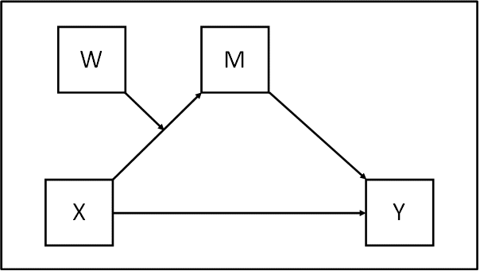
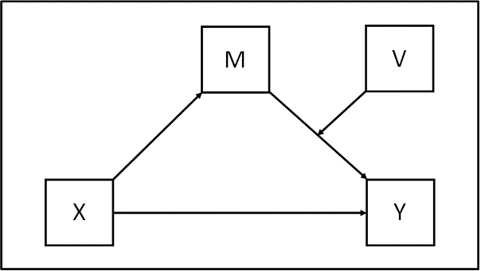
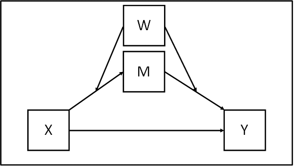

In my previous coursework, I've used Mplus quite a lot for structural equation modeling. This time I want to try reproducing three moderated mediation models entirely in R using `lavaan`. 
## Portfolio Goals
+ Simulate data for moderated mediation with latent variables
+ Fit three model variants in `lavaan`: first-stage, second-stage, and dual-stage moderation
+ Plot path diagrams in ggplot2 (the classic "arrow-to-arrow" convention)
+ Plot conditional indirect effects across moderator levels

## Intro
Before we begin, let's briefly introduce the differences among these models.

#### **First-stage moderation (Hayes Model 7):** 

W moderates the a-path. The effect of X on M depends on W, but the effect of M on Y is constant. 


**The conceptual model for Model 7**:



#### **Second-stage moderation (Hayes Model 14):** 

W moderates the b-path. The effect of X on M is constant, but how M translates into Y depends on W.


**The conceptual model for Model 14**:




#### **Dual-stage moderation (Hayes Model 58):** 

W moderates both the a-path and the b-path. The entire indirect pathway is conditional on W.


**The conceptual model for Model 58**:



<span style="color: deepskyblue;">*Note*: All figures are adapted from *https://www.figureitout.org.uk*. This is a resource I often use when working with Mplus; the site provides many helpful diagrams and example codes *(Mplus)* for mediation and moderated mediation models.</span>


## Part 1: Setup and Data Simulation
```{r setup, warning=FALSE, message=FALSE}
library(tidyverse)
library(lavaan)
library(semPlot)
```

```{r simulate}
set.seed(42)
n <- 500

# Latent scores
W <- rnorm(n)
X <- rnorm(n)
XW <- X * W

a1 <- 0.35; a2 <- 0.15; a3 <- 0.30   # X->M, W->M, XW->M
b1 <- 0.45; b2 <- 0.10; b3 <- 0.20   # M->Y, W->Y, MW->Y
cp <- 0.10                             # X->Y direct

M <- a1*X + a2*W + a3*XW + rnorm(n, sd = 0.8)
MW <- M * W
Y <- b1*M + b2*W + b3*MW + cp*X + rnorm(n, sd = 0.7)

# 3 indicators per latent variable
make_indicators <- function(latent, prefix, loadings = c(0.8, 0.75, 0.7)) {
  d <- data.frame(
    v1 = loadings[1]*latent + rnorm(n, sd = 0.5),
    v2 = loadings[2]*latent + rnorm(n, sd = 0.5),
    v3 = loadings[3]*latent + rnorm(n, sd = 0.5)
  )
  names(d) <- paste0(prefix, 1:3)
  d
}

dat <- bind_cols(
  make_indicators(X, "x"),
  make_indicators(M, "m"),
  make_indicators(Y, "y"),
  make_indicators(W, "w")
)

# Product indicators (matched-pair)
dat$xw1 <- dat$x1 * dat$w1
dat$xw2 <- dat$x2 * dat$w2
dat$xw3 <- dat$x3 * dat$w3
dat$mw1 <- dat$m1 * dat$w1
dat$mw2 <- dat$m2 * dat$w2
dat$mw3 <- dat$m3 * dat$w3

# Mean-center
dat <- dat %>% mutate(across(everything(), ~ scale(., scale = FALSE)[,1]))
```


## Part 2: First-stage Moderation

In practice, specifying this model in **lavaan** follows a logic very similar to **Mplus**. The main idea is simply to write out the corresponding measurement and structural equations, and then define the conditional indirect effects using parameter labels. 

A useful way to writing model code is ~~through copy and paste~~ through the statistical diagram of the model. 

(actually copy paste is the most simple and easy way, as long as you know what they are doiing, so the diagram here is important)


**Statistical diagram of Model 7**


 *Note:* The statistic diagrams here are also adapted from the website we mentioned above [Figure It Out](https://www.figureitout.org.uk).
 

```{r fit-first-stage, warning=FALSE, message=FALSE}
model_first <- '
  # Measurement model
  LX =~ x1 + x2 + x3
  LM =~ m1 + m2 + m3
  LY =~ y1 + y2 + y3
  LW =~ w1 + w2 + w3
  LXW =~ xw1 + xw2 + xw3

  # Structural model: W moderates a-path only
  LM ~ a1*LX + a2*LW + a3*LXW
  LY ~ b*LM + cp*LX

  # Conditional indirect effects
  indirect_low  := (a1 + a3*(-1)) * b
  indirect_mean := (a1 + a3*0) * b
  indirect_high := (a1 + a3*1) * b
  index_mod_med := a3 * b
'

fit_first <- sem(model_first, data = dat, se = "bootstrap", bootstrap = 500)
summary(fit_first, fit.measures = TRUE, standardized = TRUE)

params_first <- parameterEstimates(fit_first, boot.ci.type = "perc")

```

```{r sempath-first, fig.width=12, fig.height=8}
semPaths(fit_first,
         whatLabels = "std",
         style = "lisrel",
         layout = "tree2",
         edge.label.cex = 0.7,
         sizeMan = 5, sizeLat = 9,
         residuals = FALSE,
         intercepts = FALSE,
         thresholds = FALSE,
         nCharNodes = 0,
         fade = FALSE,
         edge.color = "gray30",
         mar = c(2, 2, 2, 2),
         title = TRUE)
```


## Part 3: Second-Stage Moderation

**Statistical diagram of Model 14**


```{r fit-second-stage, warning=FALSE, message=FALSE}
model_second <- '
  LX =~ x1 + x2 + x3
  LM =~ m1 + m2 + m3
  LY =~ y1 + y2 + y3
  LW =~ w1 + w2 + w3
  LMW =~ mw1 + mw2 + mw3

  # W moderates b-path only
  LM ~ a*LX
  LY ~ b1*LM + b2*LW + b3*LMW + cp*LX

  indirect_low  := a * (b1 + b3*(-1))
  indirect_mean := a * (b1 + b3*0)
  indirect_high := a * (b1 + b3*1)
  index_mod_med := a * b3
'

fit_second <- sem(model_second, data = dat, se = "bootstrap", bootstrap = 500)
summary(fit_second, fit.measures = TRUE, standardized = TRUE)
params_second <- parameterEstimates(fit_second, boot.ci.type = "perc")
```


```{r sempath-second, fig.width=12, fig.height=8}
semPaths(fit_second,
         whatLabels = "std",
         style = "lisrel",
         layout = "tree2",
         edge.label.cex = 0.7,
         sizeMan = 5, sizeLat = 9,
         residuals = FALSE,
         intercepts = FALSE,
         thresholds = FALSE,
         nCharNodes = 0,
         fade = FALSE,
         edge.color = "gray30",
         mar = c(2, 2, 2, 2),
         title = TRUE)
```


## Part 4: Dual-Stage Moderation

**Statistical diagram of Model 58**


```{r fit-dual-stage, warning=FALSE, message=FALSE}
model_dual <- '
  LX =~ x1 + x2 + x3
  LM =~ m1 + m2 + m3
  LY =~ y1 + y2 + y3
  LW =~ w1 + w2 + w3
  LXW =~ xw1 + xw2 + xw3
  LMW =~ mw1 + mw2 + mw3

  # W moderates both a-path and b-path
  LM ~ a1*LX + a2*LW + a3*LXW
  LY ~ b1*LM + b2*LW + b3*LMW + cp*LX

  # Conditional indirect = (a1 + a3*W) * (b1 + b3*W)
  indirect_low  := (a1 + a3*(-1)) * (b1 + b3*(-1))
  indirect_mean := (a1 + a3*0) * (b1 + b3*0)
  indirect_high := (a1 + a3*1) * (b1 + b3*1)
'

fit_dual <- sem(model_dual, data = dat, se = "bootstrap", bootstrap = 500)
summary(fit_dual, fit.measures = TRUE, standardized = TRUE)
params_dual <- parameterEstimates(fit_dual, boot.ci.type = "perc")
```

```{r sempath-dual, fig.width=12, fig.height=8}
semPaths(fit_dual,
         whatLabels = "std",
         style = "lisrel",
         layout = "tree2",
         edge.label.cex = 0.7,
         sizeMan = 5, sizeLat = 9,
         residuals = FALSE,
         intercepts = FALSE,
         thresholds = FALSE,
         nCharNodes = 0,
         fade = FALSE,
         edge.color = "gray30",
         mar = c(2, 2, 2, 2),
         title = TRUE)
```


## Part 5: Conditional Indirect Effects

For each model, One important visualization is that ploting how the indirect effect changes as the moderator W varies which is the indirect effect is not a single number, it's a function of W.. However Mplus does't provide such output.So try R here:


### First-Stage Moderation

```{r indirect-first, fig.width=8, fig.height=5}
p1 <- params_first
a1_est <- p1$est[p1$label == "a1"]
a3_est <- p1$est[p1$label == "a3"]
b_est  <- p1$est[p1$label == "b"]

w <- seq(-2.5, 2.5, by = 0.05)
indirect <- (a1_est + a3_est * w) * b_est

curve_df <- data.frame(w, indirect)

key_w <- c(-1, 0, 1)
key_indirect <- (a1_est + a3_est * key_w) * b_est
key_df <- data.frame(w = key_w, indirect = key_indirect)

ggplot(curve_df, aes(w, indirect)) +
  geom_line(color = "#2980B9", linewidth = 1) +
  geom_hline(yintercept = 0, linetype = "dashed") +
  geom_point(data = key_df, size = 3) +
  geom_text(data = key_df,
            aes(label = round(indirect, 3)),
            nudge_y = 0.02) +
  labs(
    title = "Conditional Indirect Effect",
    x = "Moderator W",
    y = "Indirect Effect"
  ) +
  theme_minimal()
```

### Second-Stage Moderation

```{r indirect-second, fig.width=8, fig.height=5}
p2 <- params_second
a_est  <- p2$est[p2$label == "a"]
b1_est <- p2$est[p2$label == "b1"]
b3_est <- p2$est[p2$label == "b3"]

w <- seq(-2.5, 2.5, by = 0.05)
indirect <- a_est * (b1_est + b3_est * w)

curve_df <- data.frame(w, indirect)

# key points
key_w <- c(-1, 0, 1)
key_indirect <- a_est * (b1_est + b3_est * key_w)
key_df <- data.frame(w = key_w, indirect = key_indirect)

ggplot(curve_df, aes(w, indirect)) +
  geom_line(color = "#4C8C6A", linewidth = 1) +
  geom_hline(yintercept = 0, linetype = "dashed") +
  geom_point(data = key_df, size = 3) +
  geom_text(data = key_df,
            aes(label = round(indirect, 3)),
            nudge_y = 0.02) +
  labs(
    title = "Model 2: Conditional Indirect Effect (Second-Stage)",
    subtitle = "Indirect = a × [b1 + b3W]",
    x = "Moderator W",
    y = "Indirect Effect"
  ) +
  theme_minimal()
```
### Dual-Stage Moderation

```{r indirect-dual, fig.width=8, fig.height=5}
p3 <- params_dual
a1_est <- p3$est[p3$label == "a1"]
a3_est <- p3$est[p3$label == "a3"]
b1_est <- p3$est[p3$label == "b1"]
b3_est <- p3$est[p3$label == "b3"]

w <- seq(-2.5, 2.5, by = 0.05)
indirect <- (a1_est + a3_est * w) * (b1_est + b3_est * w)

curve_df <- data.frame(w, indirect)

# key points
key_w <- c(-1, 0, 1)
key_indirect <- (a1_est + a3_est * key_w) * (b1_est + b3_est * key_w)
key_df <- data.frame(w = key_w, indirect = key_indirect)

ggplot(curve_df, aes(w, indirect)) +
  geom_line(color = "#8C6D5A", linewidth = 1) +
  geom_hline(yintercept = 0, linetype = "dashed") +
  geom_point(data = key_df, size = 3) +
  geom_text(data = key_df,
            aes(label = round(indirect, 3)),
            nudge_y = 0.02) +
  labs(
    title = "Model 3: Conditional Indirect Effect (Dual-Stage)",
    subtitle = "Indirect = [a1 + a3W] × [b1 + b3W]",
    x = "Moderator W",
    y = "Indirect Effect"
  ) +
  theme_minimal()
```

Note: this curve is **quadratic** (not a straight line) because both the a-path and b-path are functions of W, so the indirect effect is `(a1 + a3*W)(b1 + b3*W)` which expands to a second-degree polynomial.

