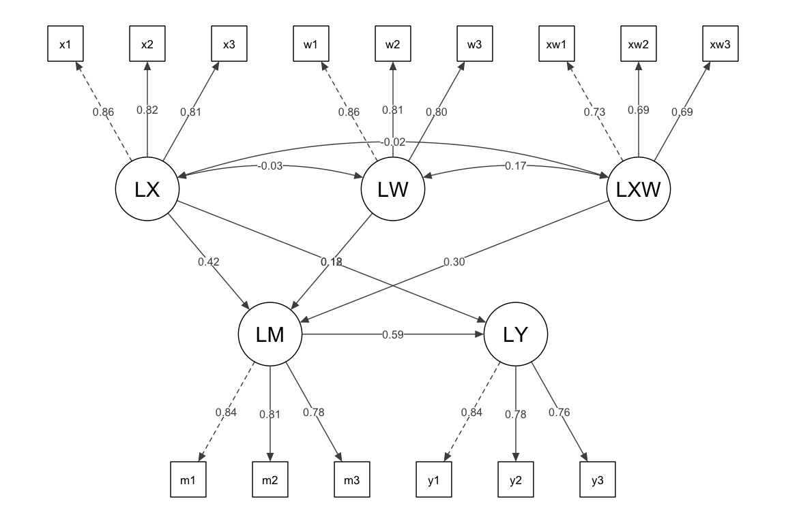
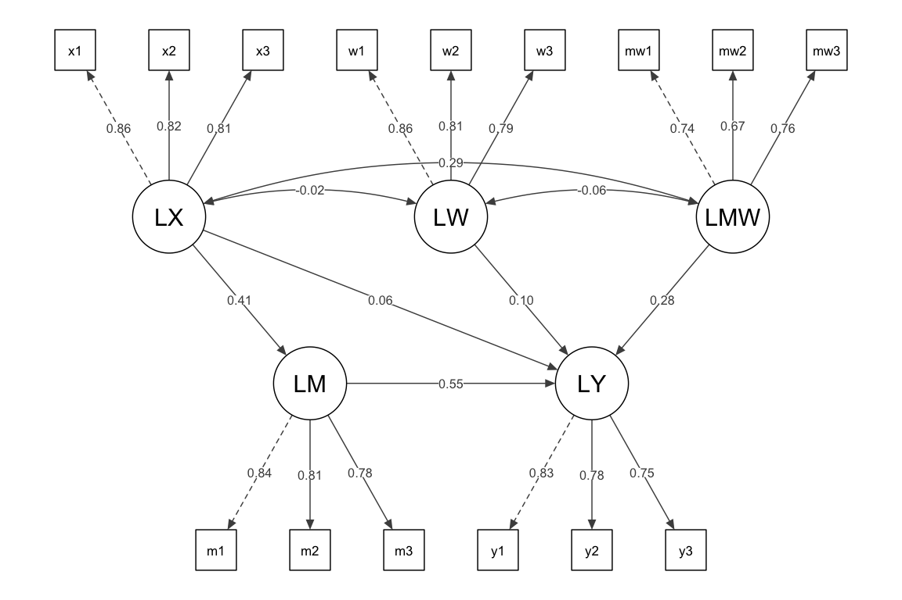
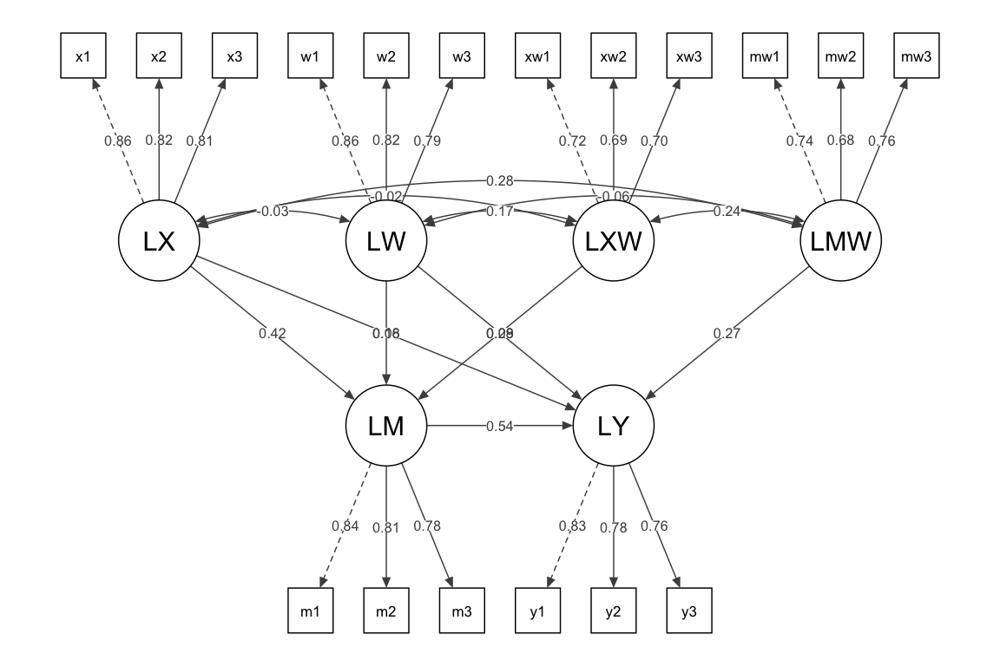
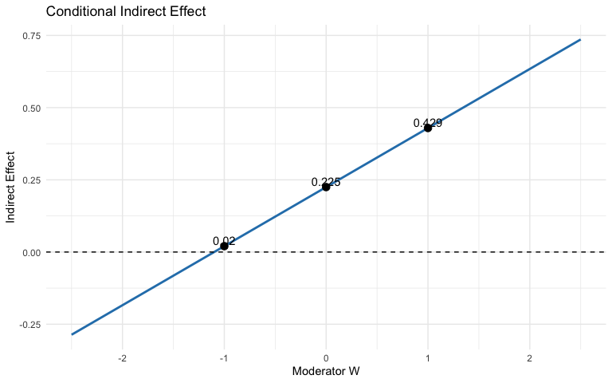
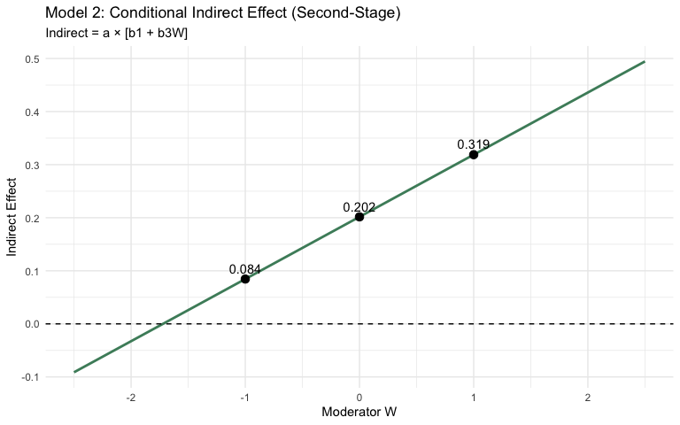
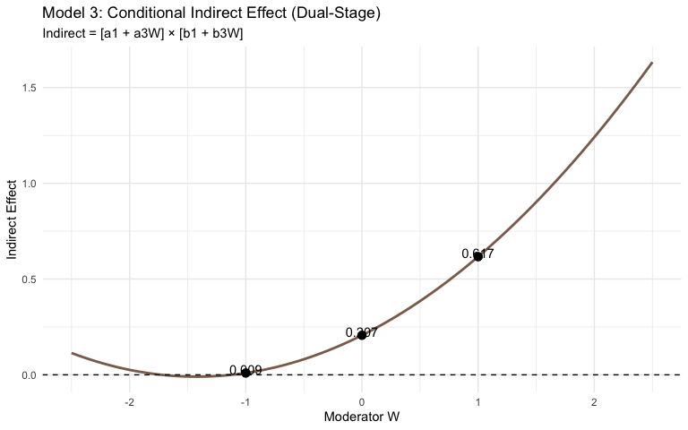

Portfolio4
================
Holland Sun

In my previous coursework, I’ve used Mplus quite a lot for structural
equation modeling. This time I want to try reproducing three moderated
mediation models entirely in R using `lavaan`. \## Portfolio Goals +
Simulate data for moderated mediation with latent variables + Fit three
model variants in `lavaan`: first-stage, second-stage, and dual-stage
moderation + Plot path diagrams in ggplot2 (the classic “arrow-to-arrow”
convention) + Plot conditional indirect effects across moderator levels

## Intro

Before we begin, let’s briefly introduce the differences among these
models.

#### **First-stage moderation (Hayes Model 7):**

W moderates the a-path. The effect of X on M depends on W, but the
effect of M on Y is constant.

**The conceptual model for Model 7**:


#### **Second-stage moderation (Hayes Model 14):**

W moderates the b-path. The effect of X on M is constant, but how M
translates into Y depends on W.

**The conceptual model for Model 14**:


#### **Dual-stage moderation (Hayes Model 58):**

W moderates both the a-path and the b-path. The entire indirect pathway
is conditional on W.

**The conceptual model for Model 58**:


<span style="color: deepskyblue;">*Note*: All figures are adapted from
*<https://www.figureitout.org.uk>*. This is a resource I often use when
working with Mplus; the site provides many helpful diagrams and example
codes *(Mplus)* for mediation and moderated mediation models.</span>

## Part 1: Setup and Data Simulation

``` r
library(tidyverse)
library(lavaan)
library(semPlot)
```

``` r
set.seed(42)
n <- 500

# Latent scores
W <- rnorm(n)
X <- rnorm(n)
XW <- X * W

a1 <- 0.35; a2 <- 0.15; a3 <- 0.30   # X->M, W->M, XW->M
b1 <- 0.45; b2 <- 0.10; b3 <- 0.20   # M->Y, W->Y, MW->Y
cp <- 0.10                             # X->Y direct

M <- a1*X + a2*W + a3*XW + rnorm(n, sd = 0.8)
MW <- M * W
Y <- b1*M + b2*W + b3*MW + cp*X + rnorm(n, sd = 0.7)

# 3 indicators per latent variable
make_indicators <- function(latent, prefix, loadings = c(0.8, 0.75, 0.7)) {
  d <- data.frame(
    v1 = loadings[1]*latent + rnorm(n, sd = 0.5),
    v2 = loadings[2]*latent + rnorm(n, sd = 0.5),
    v3 = loadings[3]*latent + rnorm(n, sd = 0.5)
  )
  names(d) <- paste0(prefix, 1:3)
  d
}

dat <- bind_cols(
  make_indicators(X, "x"),
  make_indicators(M, "m"),
  make_indicators(Y, "y"),
  make_indicators(W, "w")
)

# Product indicators (matched-pair)
dat$xw1 <- dat$x1 * dat$w1
dat$xw2 <- dat$x2 * dat$w2
dat$xw3 <- dat$x3 * dat$w3
dat$mw1 <- dat$m1 * dat$w1
dat$mw2 <- dat$m2 * dat$w2
dat$mw3 <- dat$m3 * dat$w3

# Mean-center
dat <- dat %>% mutate(across(everything(), ~ scale(., scale = FALSE)[,1]))
```

## Part 2: First-stage Moderation

In practice, specifying this model in **lavaan** follows a logic very
similar to **Mplus**. The main idea is simply to write out the
corresponding measurement and structural equations, and then define the
conditional indirect effects using parameter labels.

A useful way to writing model code is ~~through copy and paste~~ through
the statistical diagram of the model.

(actually copy paste is the most simple and easy way, as long as you
know what they are doiing, so the diagram here is important)

**Statistical diagram of Model 7**


*Note:* The statistic diagrams here are also adapted from the website we
mentioned above [Figure It Out](https://www.figureitout.org.uk).

``` r
model_first <- '
  # Measurement model
  LX =~ x1 + x2 + x3
  LM =~ m1 + m2 + m3
  LY =~ y1 + y2 + y3
  LW =~ w1 + w2 + w3
  LXW =~ xw1 + xw2 + xw3

  # Structural model: W moderates a-path only
  LM ~ a1*LX + a2*LW + a3*LXW
  LY ~ b*LM + cp*LX

  # Conditional indirect effects
  indirect_low  := (a1 + a3*(-1)) * b
  indirect_mean := (a1 + a3*0) * b
  indirect_high := (a1 + a3*1) * b
  index_mod_med := a3 * b
'

fit_first <- sem(model_first, data = dat, se = "bootstrap", bootstrap = 500)
summary(fit_first, fit.measures = TRUE, standardized = TRUE)
```

    ## lavaan 0.6-21 ended normally after 37 iterations
    ## 
    ##   Estimator                                         ML
    ##   Optimization method                           NLMINB
    ##   Number of model parameters                        38
    ## 
    ##   Number of observations                           500
    ## 
    ## Model Test User Model:
    ##                                                       
    ##   Test statistic                               122.901
    ##   Degrees of freedom                                82
    ##   P-value (Chi-square)                           0.002
    ## 
    ## Model Test Baseline Model:
    ## 
    ##   Test statistic                              3446.947
    ##   Degrees of freedom                               105
    ##   P-value                                        0.000
    ## 
    ## User Model versus Baseline Model:
    ## 
    ##   Comparative Fit Index (CFI)                    0.988
    ##   Tucker-Lewis Index (TLI)                       0.984
    ## 
    ## Loglikelihood and Information Criteria:
    ## 
    ##   Loglikelihood user model (H0)              -7881.958
    ##   Loglikelihood unrestricted model (H1)      -7820.507
    ##                                                       
    ##   Akaike (AIC)                               15839.915
    ##   Bayesian (BIC)                             16000.071
    ##   Sample-size adjusted Bayesian (SABIC)      15879.456
    ## 
    ## Root Mean Square Error of Approximation:
    ## 
    ##   RMSEA                                          0.032
    ##   90 Percent confidence interval - lower         0.019
    ##   90 Percent confidence interval - upper         0.043
    ##   P-value H_0: RMSEA <= 0.050                    0.998
    ##   P-value H_0: RMSEA >= 0.080                    0.000
    ## 
    ## Standardized Root Mean Square Residual:
    ## 
    ##   SRMR                                           0.031
    ## 
    ## Parameter Estimates:
    ## 
    ##   Standard errors                            Bootstrap
    ##   Number of requested bootstrap draws              500
    ##   Number of successful bootstrap draws             500
    ## 
    ## Latent Variables:
    ##                    Estimate  Std.Err  z-value  P(>|z|)   Std.lv  Std.all
    ##   LX =~                                                                 
    ##     x1                1.000                               0.823    0.860
    ##     x2                0.936    0.042   22.487    0.000    0.770    0.823
    ##     x3                0.880    0.042   20.793    0.000    0.724    0.810
    ##   LM =~                                                                 
    ##     m1                1.000                               0.724    0.836
    ##     m2                0.981    0.057   17.207    0.000    0.710    0.807
    ##     m3                0.866    0.051   16.972    0.000    0.627    0.782
    ##   LY =~                                                                 
    ##     y1                1.000                               0.741    0.836
    ##     y2                0.867    0.055   15.852    0.000    0.642    0.778
    ##     y3                0.819    0.052   15.818    0.000    0.607    0.756
    ##   LW =~                                                                 
    ##     w1                1.000                               0.786    0.858
    ##     w2                0.856    0.047   18.291    0.000    0.673    0.815
    ##     w3                0.878    0.053   16.419    0.000    0.690    0.795
    ##   LXW =~                                                                
    ##     xw1               1.000                               0.637    0.725
    ##     xw2               0.863    0.135    6.384    0.000    0.550    0.690
    ##     xw3               0.912    0.142    6.415    0.000    0.582    0.691
    ## 
    ## Regressions:
    ##                    Estimate  Std.Err  z-value  P(>|z|)   Std.lv  Std.all
    ##   LM ~                                                                  
    ##     LX        (a1)    0.373    0.048    7.772    0.000    0.425    0.425
    ##     LW        (a2)    0.170    0.044    3.817    0.000    0.184    0.184
    ##     LXW       (a3)    0.339    0.067    5.050    0.000    0.299    0.299
    ##   LY ~                                                                  
    ##     LM         (b)    0.603    0.062    9.684    0.000    0.588    0.588
    ##     LX        (cp)    0.108    0.049    2.186    0.029    0.120    0.120
    ## 
    ## Covariances:
    ##                    Estimate  Std.Err  z-value  P(>|z|)   Std.lv  Std.all
    ##   LX ~~                                                                 
    ##     LW               -0.020    0.036   -0.563    0.573   -0.031   -0.031
    ##     LXW              -0.013    0.055   -0.228    0.820   -0.024   -0.024
    ##   LW ~~                                                                 
    ##     LXW               0.085    0.055    1.550    0.121    0.169    0.169
    ## 
    ## Variances:
    ##                    Estimate  Std.Err  z-value  P(>|z|)   Std.lv  Std.all
    ##    .x1                0.239    0.027    8.704    0.000    0.239    0.261
    ##    .x2                0.282    0.026   10.691    0.000    0.282    0.322
    ##    .x3                0.275    0.026   10.780    0.000    0.275    0.344
    ##    .m1                0.225    0.024    9.434    0.000    0.225    0.300
    ##    .m2                0.270    0.024   11.014    0.000    0.270    0.349
    ##    .m3                0.250    0.021   11.734    0.000    0.250    0.389
    ##    .y1                0.237    0.027    8.946    0.000    0.237    0.302
    ##    .y2                0.269    0.023   11.911    0.000    0.269    0.394
    ##    .y3                0.277    0.023   11.965    0.000    0.277    0.429
    ##    .w1                0.221    0.025    8.730    0.000    0.221    0.263
    ##    .w2                0.230    0.021   11.037    0.000    0.230    0.336
    ##    .w3                0.277    0.024   11.513    0.000    0.277    0.367
    ##    .xw1               0.366    0.061    5.963    0.000    0.366    0.474
    ##    .xw2               0.332    0.044    7.510    0.000    0.332    0.523
    ##    .xw3               0.370    0.051    7.324    0.000    0.370    0.523
    ##     LX                0.678    0.059   11.483    0.000    1.000    1.000
    ##    .LM                0.361    0.035   10.295    0.000    0.689    0.689
    ##    .LY                0.319    0.034    9.349    0.000    0.582    0.582
    ##     LW                0.618    0.063    9.768    0.000    1.000    1.000
    ##     LXW               0.406    0.111    3.677    0.000    1.000    1.000
    ## 
    ## Defined Parameters:
    ##                    Estimate  Std.Err  z-value  P(>|z|)   Std.lv  Std.all
    ##     indirect_low      0.020    0.043    0.469    0.639    0.074    0.074
    ##     indirect_mean     0.225    0.034    6.608    0.000    0.250    0.250
    ##     indirect_high     0.429    0.066    6.523    0.000    0.426    0.426
    ##     index_mod_med     0.205    0.044    4.629    0.000    0.176    0.176

``` r
params_first <- parameterEstimates(fit_first, boot.ci.type = "perc")
```

``` r
semPaths(fit_first,
         whatLabels = "std",
         style = "lisrel",
         layout = "tree2",
         edge.label.cex = 0.7,
         sizeMan = 5, sizeLat = 9,
         residuals = FALSE,
         intercepts = FALSE,
         thresholds = FALSE,
         nCharNodes = 0,
         fade = FALSE,
         edge.color = "gray30",
         mar = c(2, 2, 2, 2),
         title = TRUE)
```

<!-- -->

## Part 3: Second-Stage Moderation

**Statistical diagram of Model 14**


``` r
model_second <- '
  LX =~ x1 + x2 + x3
  LM =~ m1 + m2 + m3
  LY =~ y1 + y2 + y3
  LW =~ w1 + w2 + w3
  LMW =~ mw1 + mw2 + mw3

  # W moderates b-path only
  LM ~ a*LX
  LY ~ b1*LM + b2*LW + b3*LMW + cp*LX

  indirect_low  := a * (b1 + b3*(-1))
  indirect_mean := a * (b1 + b3*0)
  indirect_high := a * (b1 + b3*1)
  index_mod_med := a * b3
'

fit_second <- sem(model_second, data = dat, se = "bootstrap", bootstrap = 500)
summary(fit_second, fit.measures = TRUE, standardized = TRUE)
```

    ## lavaan 0.6-21 ended normally after 35 iterations
    ## 
    ##   Estimator                                         ML
    ##   Optimization method                           NLMINB
    ##   Number of model parameters                        38
    ## 
    ##   Number of observations                           500
    ## 
    ## Model Test User Model:
    ##                                                       
    ##   Test statistic                               121.013
    ##   Degrees of freedom                                82
    ##   P-value (Chi-square)                           0.003
    ## 
    ## Model Test Baseline Model:
    ## 
    ##   Test statistic                              3496.870
    ##   Degrees of freedom                               105
    ##   P-value                                        0.000
    ## 
    ## User Model versus Baseline Model:
    ## 
    ##   Comparative Fit Index (CFI)                    0.988
    ##   Tucker-Lewis Index (TLI)                       0.985
    ## 
    ## Loglikelihood and Information Criteria:
    ## 
    ##   Loglikelihood user model (H0)              -7711.324
    ##   Loglikelihood unrestricted model (H1)      -7650.817
    ##                                                       
    ##   Akaike (AIC)                               15498.648
    ##   Bayesian (BIC)                             15658.803
    ##   Sample-size adjusted Bayesian (SABIC)      15538.188
    ## 
    ## Root Mean Square Error of Approximation:
    ## 
    ##   RMSEA                                          0.031
    ##   90 Percent confidence interval - lower         0.018
    ##   90 Percent confidence interval - upper         0.042
    ##   P-value H_0: RMSEA <= 0.050                    0.998
    ##   P-value H_0: RMSEA >= 0.080                    0.000
    ## 
    ## Standardized Root Mean Square Residual:
    ## 
    ##   SRMR                                           0.051
    ## 
    ## Parameter Estimates:
    ## 
    ##   Standard errors                            Bootstrap
    ##   Number of requested bootstrap draws              500
    ##   Number of successful bootstrap draws             500
    ## 
    ## Latent Variables:
    ##                    Estimate  Std.Err  z-value  P(>|z|)   Std.lv  Std.all
    ##   LX =~                                                                 
    ##     x1                1.000                               0.825    0.862
    ##     x2                0.932    0.042   22.226    0.000    0.769    0.822
    ##     x3                0.876    0.042   20.693    0.000    0.723    0.808
    ##   LM =~                                                                 
    ##     m1                1.000                               0.725    0.838
    ##     m2                0.983    0.057   17.132    0.000    0.713    0.811
    ##     m3                0.862    0.050   17.132    0.000    0.625    0.780
    ##   LY =~                                                                 
    ##     y1                1.000                               0.731    0.830
    ##     y2                0.874    0.056   15.733    0.000    0.639    0.779
    ##     y3                0.821    0.052   15.847    0.000    0.600    0.751
    ##   LW =~                                                                 
    ##     w1                1.000                               0.789    0.862
    ##     w2                0.852    0.047   18.283    0.000    0.672    0.813
    ##     w3                0.872    0.053   16.512    0.000    0.688    0.793
    ##   LMW =~                                                                
    ##     mw1               1.000                               0.626    0.743
    ##     mw2               0.767    0.096    8.020    0.000    0.480    0.675
    ##     mw3               0.891    0.123    7.228    0.000    0.558    0.758
    ## 
    ## Regressions:
    ##                    Estimate  Std.Err  z-value  P(>|z|)   Std.lv  Std.all
    ##   LM ~                                                                  
    ##     LX         (a)    0.361    0.050    7.276    0.000    0.411    0.411
    ##   LY ~                                                                  
    ##     LM        (b1)    0.558    0.058    9.622    0.000    0.554    0.554
    ##     LW        (b2)    0.095    0.041    2.320    0.020    0.103    0.103
    ##     LMW       (b3)    0.324    0.071    4.558    0.000    0.278    0.278
    ##     LX        (cp)    0.058    0.049    1.178    0.239    0.065    0.065
    ## 
    ## Covariances:
    ##                    Estimate  Std.Err  z-value  P(>|z|)   Std.lv  Std.all
    ##   LX ~~                                                                 
    ##     LW               -0.012    0.037   -0.335    0.738   -0.019   -0.019
    ##     LMW               0.149    0.040    3.672    0.000    0.288    0.288
    ##   LW ~~                                                                 
    ##     LMW              -0.031    0.056   -0.547    0.584   -0.063   -0.063
    ## 
    ## Variances:
    ##                    Estimate  Std.Err  z-value  P(>|z|)   Std.lv  Std.all
    ##    .x1                0.236    0.028    8.298    0.000    0.236    0.257
    ##    .x2                0.284    0.027   10.713    0.000    0.284    0.325
    ##    .x3                0.277    0.025   10.986    0.000    0.277    0.346
    ##    .m1                0.223    0.024    9.359    0.000    0.223    0.298
    ##    .m2                0.265    0.025   10.651    0.000    0.265    0.343
    ##    .m3                0.252    0.022   11.670    0.000    0.252    0.392
    ##    .y1                0.241    0.026    9.130    0.000    0.241    0.311
    ##    .y2                0.265    0.023   11.562    0.000    0.265    0.394
    ##    .y3                0.278    0.023   12.058    0.000    0.278    0.436
    ##    .w1                0.216    0.025    8.610    0.000    0.216    0.258
    ##    .w2                0.231    0.021   11.080    0.000    0.231    0.338
    ##    .w3                0.280    0.024   11.680    0.000    0.280    0.371
    ##    .mw1               0.318    0.042    7.508    0.000    0.318    0.448
    ##    .mw2               0.276    0.036    7.705    0.000    0.276    0.544
    ##    .mw3               0.230    0.032    7.086    0.000    0.230    0.425
    ##     LX                0.681    0.060   11.397    0.000    1.000    1.000
    ##    .LM                0.437    0.042   10.387    0.000    0.831    0.831
    ##    .LY                0.283    0.032    8.876    0.000    0.530    0.530
    ##     LW                0.622    0.063    9.858    0.000    1.000    1.000
    ##     LMW               0.392    0.095    4.140    0.000    1.000    1.000
    ## 
    ## Defined Parameters:
    ##                    Estimate  Std.Err  z-value  P(>|z|)   Std.lv  Std.all
    ##     indirect_low      0.084    0.032    2.609    0.009    0.113    0.113
    ##     indirect_mean     0.202    0.035    5.833    0.000    0.228    0.228
    ##     indirect_high     0.319    0.058    5.520    0.000    0.342    0.342
    ##     index_mod_med     0.117    0.032    3.710    0.000    0.114    0.114

``` r
params_second <- parameterEstimates(fit_second, boot.ci.type = "perc")
```

``` r
semPaths(fit_second,
         whatLabels = "std",
         style = "lisrel",
         layout = "tree2",
         edge.label.cex = 0.7,
         sizeMan = 5, sizeLat = 9,
         residuals = FALSE,
         intercepts = FALSE,
         thresholds = FALSE,
         nCharNodes = 0,
         fade = FALSE,
         edge.color = "gray30",
         mar = c(2, 2, 2, 2),
         title = TRUE)
```

<!-- -->

## Part 4: Dual-Stage Moderation

**Statistical diagram of Model 58**


``` r
model_dual <- '
  LX =~ x1 + x2 + x3
  LM =~ m1 + m2 + m3
  LY =~ y1 + y2 + y3
  LW =~ w1 + w2 + w3
  LXW =~ xw1 + xw2 + xw3
  LMW =~ mw1 + mw2 + mw3

  # W moderates both a-path and b-path
  LM ~ a1*LX + a2*LW + a3*LXW
  LY ~ b1*LM + b2*LW + b3*LMW + cp*LX

  # Conditional indirect = (a1 + a3*W) * (b1 + b3*W)
  indirect_low  := (a1 + a3*(-1)) * (b1 + b3*(-1))
  indirect_mean := (a1 + a3*0) * (b1 + b3*0)
  indirect_high := (a1 + a3*1) * (b1 + b3*1)
'

fit_dual <- sem(model_dual, data = dat, se = "bootstrap", bootstrap = 500)
summary(fit_dual, fit.measures = TRUE, standardized = TRUE)
```

    ## lavaan 0.6-21 ended normally after 41 iterations
    ## 
    ##   Estimator                                         ML
    ##   Optimization method                           NLMINB
    ##   Number of model parameters                        49
    ## 
    ##   Number of observations                           500
    ## 
    ## Model Test User Model:
    ##                                                       
    ##   Test statistic                               186.767
    ##   Degrees of freedom                               122
    ##   P-value (Chi-square)                           0.000
    ## 
    ## Model Test Baseline Model:
    ## 
    ##   Test statistic                              3985.297
    ##   Degrees of freedom                               153
    ##   P-value                                        0.000
    ## 
    ## User Model versus Baseline Model:
    ## 
    ##   Comparative Fit Index (CFI)                    0.983
    ##   Tucker-Lewis Index (TLI)                       0.979
    ## 
    ## Loglikelihood and Information Criteria:
    ## 
    ##   Loglikelihood user model (H0)              -9364.112
    ##   Loglikelihood unrestricted model (H1)      -9270.728
    ##                                                       
    ##   Akaike (AIC)                               18826.223
    ##   Bayesian (BIC)                             19032.739
    ##   Sample-size adjusted Bayesian (SABIC)      18877.210
    ## 
    ## Root Mean Square Error of Approximation:
    ## 
    ##   RMSEA                                          0.033
    ##   90 Percent confidence interval - lower         0.023
    ##   90 Percent confidence interval - upper         0.042
    ##   P-value H_0: RMSEA <= 0.050                    1.000
    ##   P-value H_0: RMSEA >= 0.080                    0.000
    ## 
    ## Standardized Root Mean Square Residual:
    ## 
    ##   SRMR                                           0.028
    ## 
    ## Parameter Estimates:
    ## 
    ##   Standard errors                            Bootstrap
    ##   Number of requested bootstrap draws              500
    ##   Number of successful bootstrap draws             500
    ## 
    ## Latent Variables:
    ##                    Estimate  Std.Err  z-value  P(>|z|)   Std.lv  Std.all
    ##   LX =~                                                                 
    ##     x1                1.000                               0.825    0.862
    ##     x2                0.933    0.041   22.564    0.000    0.770    0.822
    ##     x3                0.877    0.043   20.613    0.000    0.723    0.809
    ##   LM =~                                                                 
    ##     m1                1.000                               0.725    0.838
    ##     m2                0.978    0.057   17.102    0.000    0.710    0.807
    ##     m3                0.864    0.051   16.931    0.000    0.627    0.782
    ##   LY =~                                                                 
    ##     y1                1.000                               0.742    0.834
    ##     y2                0.873    0.056   15.704    0.000    0.647    0.783
    ##     y3                0.820    0.052   15.843    0.000    0.608    0.756
    ##   LW =~                                                                 
    ##     w1                1.000                               0.786    0.858
    ##     w2                0.857    0.047   18.228    0.000    0.674    0.816
    ##     w3                0.877    0.053   16.476    0.000    0.689    0.794
    ##   LXW =~                                                                
    ##     xw1               1.000                               0.632    0.719
    ##     xw2               0.867    0.132    6.578    0.000    0.548    0.688
    ##     xw3               0.935    0.158    5.914    0.000    0.591    0.701
    ##   LMW =~                                                                
    ##     mw1               1.000                               0.620    0.736
    ##     mw2               0.779    0.097    8.006    0.000    0.483    0.679
    ##     mw3               0.902    0.122    7.366    0.000    0.559    0.761
    ## 
    ## Regressions:
    ##                    Estimate  Std.Err  z-value  P(>|z|)   Std.lv  Std.all
    ##   LM ~                                                                  
    ##     LX        (a1)    0.371    0.047    7.911    0.000    0.422    0.422
    ##     LW        (a2)    0.166    0.045    3.685    0.000    0.179    0.179
    ##     LXW       (a3)    0.330    0.067    4.944    0.000    0.288    0.288
    ##   LY ~                                                                  
    ##     LM        (b1)    0.557    0.059    9.511    0.000    0.545    0.545
    ##     LW        (b2)    0.077    0.043    1.815    0.069    0.082    0.082
    ##     LMW       (b3)    0.323    0.071    4.571    0.000    0.270    0.270
    ##     LX        (cp)    0.058    0.049    1.198    0.231    0.065    0.065
    ## 
    ## Covariances:
    ##                    Estimate  Std.Err  z-value  P(>|z|)   Std.lv  Std.all
    ##   LX ~~                                                                 
    ##     LW               -0.021    0.036   -0.589    0.556   -0.033   -0.033
    ##     LXW              -0.012    0.055   -0.227    0.821   -0.024   -0.024
    ##     LMW               0.145    0.040    3.619    0.000    0.284    0.284
    ##   LW ~~                                                                 
    ##     LXW               0.085    0.054    1.553    0.120    0.170    0.170
    ##     LMW              -0.031    0.056   -0.555    0.579   -0.064   -0.064
    ##   LXW ~~                                                                
    ##     LMW               0.095    0.065    1.444    0.149    0.241    0.241
    ## 
    ## Variances:
    ##                    Estimate  Std.Err  z-value  P(>|z|)   Std.lv  Std.all
    ##    .x1                0.236    0.028    8.497    0.000    0.236    0.258
    ##    .x2                0.283    0.026   10.804    0.000    0.283    0.324
    ##    .x3                0.277    0.025   10.867    0.000    0.277    0.346
    ##    .m1                0.222    0.024    9.287    0.000    0.222    0.297
    ##    .m2                0.270    0.025   10.929    0.000    0.270    0.348
    ##    .m3                0.250    0.021   11.659    0.000    0.250    0.388
    ##    .y1                0.240    0.026    9.142    0.000    0.240    0.304
    ##    .y2                0.265    0.023   11.581    0.000    0.265    0.387
    ##    .y3                0.278    0.023   12.076    0.000    0.278    0.429
    ##    .w1                0.221    0.025    8.756    0.000    0.221    0.263
    ##    .w2                0.228    0.021   10.988    0.000    0.228    0.335
    ##    .w3                0.278    0.024   11.571    0.000    0.278    0.370
    ##    .xw1               0.373    0.063    5.932    0.000    0.373    0.483
    ##    .xw2               0.335    0.044    7.577    0.000    0.335    0.527
    ##    .xw3               0.360    0.049    7.285    0.000    0.360    0.508
    ##    .mw1               0.326    0.044    7.389    0.000    0.326    0.459
    ##    .mw2               0.273    0.034    7.964    0.000    0.273    0.539
    ##    .mw3               0.228    0.033    6.893    0.000    0.228    0.421
    ##     LX                0.681    0.059   11.495    0.000    1.000    1.000
    ##    .LM                0.368    0.035   10.623    0.000    0.700    0.700
    ##    .LY                0.282    0.032    8.900    0.000    0.513    0.513
    ##     LW                0.618    0.063    9.758    0.000    1.000    1.000
    ##     LXW               0.399    0.111    3.605    0.000    1.000    1.000
    ##     LMW               0.385    0.093    4.129    0.000    1.000    1.000
    ## 
    ## Defined Parameters:
    ##                    Estimate  Std.Err  z-value  P(>|z|)   Std.lv  Std.all
    ##     indirect_low      0.009    0.018    0.534    0.593    0.037    0.037
    ##     indirect_mean     0.207    0.033    6.272    0.000    0.230    0.230
    ##     indirect_high     0.617    0.086    7.145    0.000    0.578    0.578

``` r
params_dual <- parameterEstimates(fit_dual, boot.ci.type = "perc")
```

``` r
semPaths(fit_dual,
         whatLabels = "std",
         style = "lisrel",
         layout = "tree2",
         edge.label.cex = 0.7,
         sizeMan = 5, sizeLat = 9,
         residuals = FALSE,
         intercepts = FALSE,
         thresholds = FALSE,
         nCharNodes = 0,
         fade = FALSE,
         edge.color = "gray30",
         mar = c(2, 2, 2, 2),
         title = TRUE)
```

<!-- -->

## Part 5: Conditional Indirect Effects

For each model, One important visualization is that ploting how the
indirect effect changes as the moderator W varies which is the indirect
effect is not a single number, it’s a function of W.. However Mplus
does’t provide such output.So try R here:

### First-Stage Moderation

``` r
p1 <- params_first
a1_est <- p1$est[p1$label == "a1"]
a3_est <- p1$est[p1$label == "a3"]
b_est  <- p1$est[p1$label == "b"]

w <- seq(-2.5, 2.5, by = 0.05)
indirect <- (a1_est + a3_est * w) * b_est

curve_df <- data.frame(w, indirect)

key_w <- c(-1, 0, 1)
key_indirect <- (a1_est + a3_est * key_w) * b_est
key_df <- data.frame(w = key_w, indirect = key_indirect)

ggplot(curve_df, aes(w, indirect)) +
  geom_line(color = "#2980B9", linewidth = 1) +
  geom_hline(yintercept = 0, linetype = "dashed") +
  geom_point(data = key_df, size = 3) +
  geom_text(data = key_df,
            aes(label = round(indirect, 3)),
            nudge_y = 0.02) +
  labs(
    title = "Conditional Indirect Effect",
    x = "Moderator W",
    y = "Indirect Effect"
  ) +
  theme_minimal()
```

<!-- -->

### Second-Stage Moderation

``` r
p2 <- params_second
a_est  <- p2$est[p2$label == "a"]
b1_est <- p2$est[p2$label == "b1"]
b3_est <- p2$est[p2$label == "b3"]

w <- seq(-2.5, 2.5, by = 0.05)
indirect <- a_est * (b1_est + b3_est * w)

curve_df <- data.frame(w, indirect)

# key points
key_w <- c(-1, 0, 1)
key_indirect <- a_est * (b1_est + b3_est * key_w)
key_df <- data.frame(w = key_w, indirect = key_indirect)

ggplot(curve_df, aes(w, indirect)) +
  geom_line(color = "#4C8C6A", linewidth = 1) +
  geom_hline(yintercept = 0, linetype = "dashed") +
  geom_point(data = key_df, size = 3) +
  geom_text(data = key_df,
            aes(label = round(indirect, 3)),
            nudge_y = 0.02) +
  labs(
    title = "Model 2: Conditional Indirect Effect (Second-Stage)",
    subtitle = "Indirect = a × [b1 + b3W]",
    x = "Moderator W",
    y = "Indirect Effect"
  ) +
  theme_minimal()
```

<!-- --> \###
Dual-Stage Moderation

``` r
p3 <- params_dual
a1_est <- p3$est[p3$label == "a1"]
a3_est <- p3$est[p3$label == "a3"]
b1_est <- p3$est[p3$label == "b1"]
b3_est <- p3$est[p3$label == "b3"]

w <- seq(-2.5, 2.5, by = 0.05)
indirect <- (a1_est + a3_est * w) * (b1_est + b3_est * w)

curve_df <- data.frame(w, indirect)

# key points
key_w <- c(-1, 0, 1)
key_indirect <- (a1_est + a3_est * key_w) * (b1_est + b3_est * key_w)
key_df <- data.frame(w = key_w, indirect = key_indirect)

ggplot(curve_df, aes(w, indirect)) +
  geom_line(color = "#8C6D5A", linewidth = 1) +
  geom_hline(yintercept = 0, linetype = "dashed") +
  geom_point(data = key_df, size = 3) +
  geom_text(data = key_df,
            aes(label = round(indirect, 3)),
            nudge_y = 0.02) +
  labs(
    title = "Model 3: Conditional Indirect Effect (Dual-Stage)",
    subtitle = "Indirect = [a1 + a3W] × [b1 + b3W]",
    x = "Moderator W",
    y = "Indirect Effect"
  ) +
  theme_minimal()
```

<!-- -->

Note: this curve is **quadratic** (not a straight line) because both the
a-path and b-path are functions of W, so the indirect effect is
`(a1 + a3*W)(b1 + b3*W)` which expands to a second-degree polynomial.
