Portfolio_Most_Expensive_On_Amazon
================
Holland Sun

I was once casually chatting with a friend and joked that she should buy
the most expensive chair possible, then sell it to me secondhand so I
could enjoy it. At the time, we literally searched “most expensive
chair” on Amazon. Of course, we were just joking. But that also made me
curious: what is actually the most expensive thing on Amazon?

Like a curious elementary school kids, I once searched the same thing on
a Chinese shopping platform during some random sleepless night. I’m
pretty sure the results there have never really changed. If search
**“最贵的东西”** (the most expensive thing) on a Chinese shopping
platform. The top results were not watches or houses or cars. They were
charity donations

Free Lunch for kids in mountain areas, donations for elderly people, all
priced at ¥1, all labeled with the slogan **“世界上最贵的东西”** (“the
most expensive thing in the world”). Maybe the idea is that the most
precious thing is not the item itself, but the small bit of kindness
each person is willing to give.


<span style="color: deepskyblue;">*I know “valuable” is probably the
more accurate word here, but I think I understand why this happens. In
English, “expensive” and “valuable” feel like two clearly different
words. But in Chinese, the way we express them can be very similar.*

*Even words like “priceless” and “valueless,” if translated too
literally, they can look almost the same in Chinese, even though their
meanings are completely opposite. I remember being confused by this for
a long time when I was learning English.lol* </span>

SO how about I tried the same thing in English on Amazon. Got…

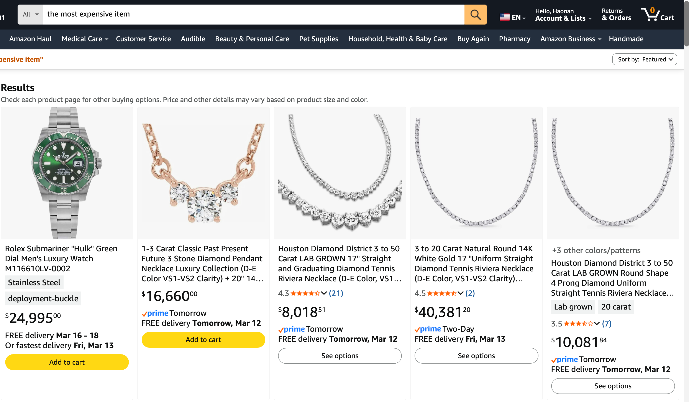 Just rows of Rolex watches
and diamond necklaces. And also I tried Google instead.

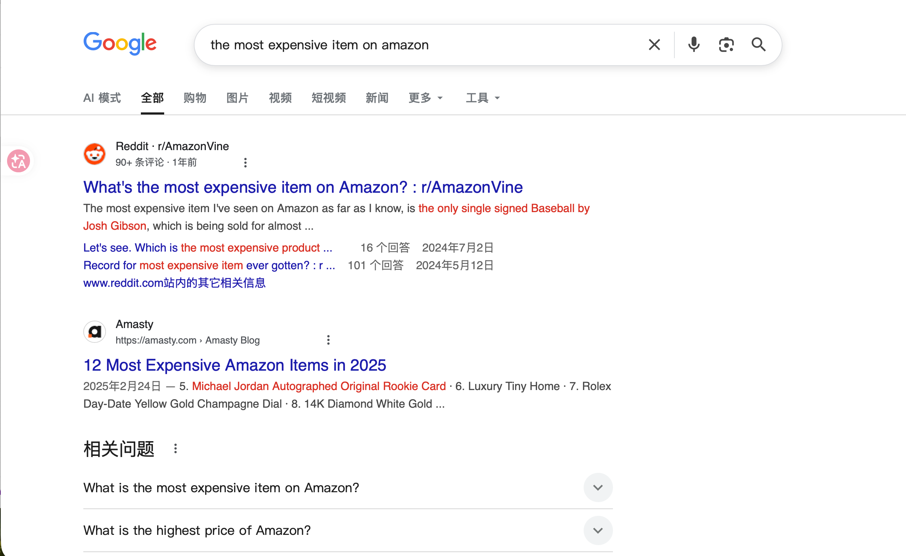

The top hits were Reddit threads (people on r/AmazonVine asking the same
question I was asking) and a blog called Amasty with a “12 Most
Expensive Amazon Items in 2025” listicle — 1952 Topps Baseball Complete
Set, luxury tiny homes, Rolex Day-Date, 14K diamond white gold
necklaces. Concrete… but these articles all cite each other.

So that’s the question for this portfolio: **can I just go get the
actual data from Amazon and find out for myself?**

## Portfolio Goals

- Figure out a working way to get **real** Amazon price data into R
  (without selling my soul to any platform)
- Visualization them

## Part 1

### 1.1 Amazon’s API

My first thought is Amazon must have an official API. And they do. It’s
called the **Product Advertising API (PA-API)** or *Creators API* （this
is a new one. But the key is to *use* the PA-API, you have to be a
member of the **Amazon Associates** program (their affiliate scheme),
and to stay in Amazon Associates, you have to make at least **3
qualifying sales within 180 days** of joining…

### 1.2 Just scrape

just scrape Amazon directly with `rvest`. Read the HTML, pull
`.a-price-whole`, done. I tried this. Two requests in, I started getting
back not the product page, several attempts and the IP-level rate
limiter kicked in and started returning HTTP 503 for everything. I tried
the Random delays between requests with `Sys.sleep(runif(1, 3, 8))`. but
it didn’t help, I guess Amazon will flags everything.

## Part 2 SerpApi

After fighting with `rvest`, I went looking for a third-party service
that handles the proxy / fingerprinting / CAPTCHA-solving on its end and
just gives me clean JSON back. The one I chose is
**[SerpApi](https://serpapi.com/)**

as they said ” we sit between you and Amazon (and Google, Bing, etc.),
do all the residential-IP rotation in the background, and expose a
simple HTTP endpoint that returns parsed search results”

<span style="color: deepskyblue;"> Actually, I don’t care too much about
how he helped me bypass the restrictions; the most important thing is
that … it’s **Free tier of 250 searches/month**, no credit card required
to start. Plenty for a portfolio.</span>

``` r
library(tidyverse)
```

    ## ── Attaching core tidyverse packages ──────────────────────── tidyverse 2.0.0 ──
    ## ✔ dplyr     1.2.0     ✔ readr     2.1.6
    ## ✔ forcats   1.0.1     ✔ stringr   1.6.0
    ## ✔ ggplot2   4.0.2     ✔ tibble    3.3.1
    ## ✔ lubridate 1.9.5     ✔ tidyr     1.3.2
    ## ✔ purrr     1.2.1     
    ## ── Conflicts ────────────────────────────────────────── tidyverse_conflicts() ──
    ## ✖ dplyr::filter() masks stats::filter()
    ## ✖ dplyr::lag()    masks stats::lag()
    ## ℹ Use the conflicted package (<http://conflicted.r-lib.org/>) to force all conflicts to become errors

``` r
library(httr2)
library(scales)
```

    ## 
    ## Attaching package: 'scales'
    ## 
    ## The following object is masked from 'package:purrr':
    ## 
    ##     discard
    ## 
    ## The following object is masked from 'package:readr':
    ## 
    ##     col_factor

``` r
library(ggrepel)
library(knitr)

# Since I wanted to showcase my original code,
# I still wrote it to a file. However, to avoid consuming quota every time it was called,
# I set up a switch.
REFRESH_DATA <- FALSE

# gitignored 
if (file.exists(".Renviron")) readRenviron(".Renviron")
SERPAPI_KEY <- Sys.getenv("SERPAPI_KEY")

CACHE_FILE  <- "data/serpapi_raw_results.rds"
TIME_FILE   <- "data/serpapi_fetch_time.rds"
```

<span style="color: deepskyblue;">BTW When I first push the submitted, I
received an email from GitHub. GitHub Guard detected that I had exposed
the API here, becasue I originally put all the information in this
chunk..</span>

## Part 3

So how to do it? Of course，keyword search is useless. When we use
Amazon’s keyword search it’s easy find that sometimes a very expensive
\$400,000 industrial laser cutter doesn’t appear in a search for
“industrial equipment” if its title doesn’t literally contain those
words. Definately we can find all keywords.

I later asked Claude about this, and it told me that the fix is to use
Amazon’s own **browse node IDs** — the numeric category IDs that show up
directly in Amazon URLs. Every top-level department (Electronics,
Industrial & Scientific, Musical Instruments, etc.) has one (somewhat
like a tree structure), and SerpApi accepts a `node` parameter that goes
through the category index instead of through the search algorithm.

I went through this in two waves.

The first wave picked eight high-end “main” departments where I expected
expensive things to live: **Industrial & Scientific, Professional
Medical Supplies, Musical Instruments, Camera & Photo, Computers, Home
Audio & Theater, Tools & Home Improvement, Sports & Outdoors**. Of
those, seven returned data; Professional Medical Supplies came back
empty (most listings there require business-account verification). After
looking at the first wave’s top items (~67K MLZ Control Room Kit, ~48K
DDR5 server memory) I realized none of them came close to the **\$284K
baseball card set in the screenshots**. So maybe I need check others.

So I added a second wave: five more nodes specifically aimed at the
collectibles / memorabilia / large-appliance corners of the catalog.

<span style="color: deepskyblue;"> To be honest, logically I should have
iterated through all categories. However, after searching for a long
time, I still couldn’t figure out how these codes were generated. BUt I’
sure they certainly weren’t as simple as ranging from 00000001 to
9999999. So, I just get them by myself, I open some potential items in
Amaozoin in website. And examined the URLs to obtain these codes. But
there should be a better way. </span>

For example I opne a web of one item 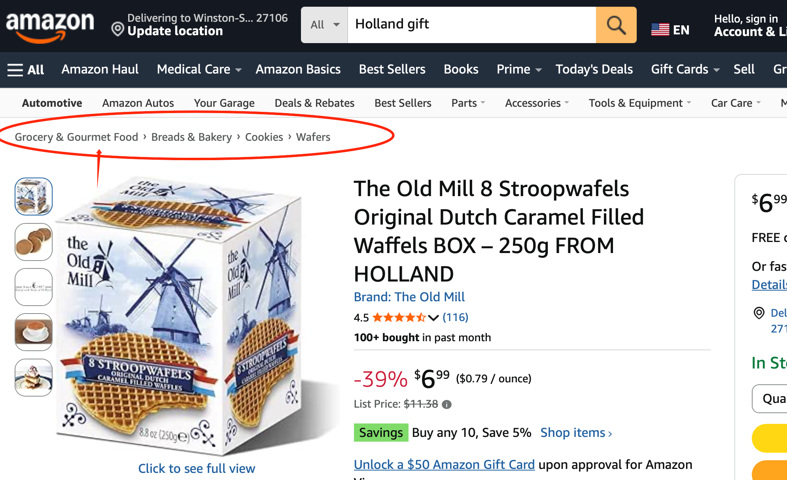 Click the first
label and get the url like.. 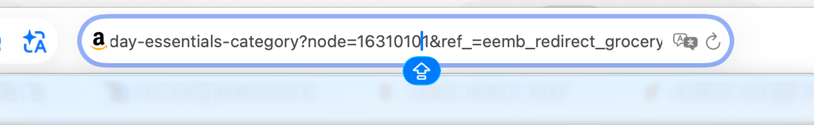 so that’s the node of that.

``` r
# SerpApi caller — given an Amazon browse node ID, returns top N items by price
search_amazon_by_node <- function(api_key, node_id, department_name,
                                  n_results = 10) {
  resp <- request("https://serpapi.com/search") |>
    req_url_query(
      engine        = "amazon",
      node          = node_id,            # Amazon browse node ID
      s             = "price-desc-rank",  # sort by price descending
      api_key       = api_key,
      amazon_domain = "amazon.com"
    ) |>
    req_error(is_error = \(r) FALSE) |>
    req_perform()

  if (resp_status(resp) != 200) {
    warning("SerpApi error ", resp_status(resp), " for node ", node_id)
    return(tibble())
  }

  items <- resp |> resp_body_json() |> pluck("organic_results")
  if (is.null(items) || length(items) == 0) return(tibble())

  # title / price / rating 
  map_dfr(head(items, n_results), function(it) {
    tibble(
      asin       = it$asin %||% NA_character_,
      title      = it$title %||% NA_character_,
      price      = suppressWarnings(as.numeric(
                     gsub("[$,]", "", as.character(
                       it$extracted_price %||% it$price %||% NA)))),
      rating     = it$rating  %||% NA_real_,
      reviews    = it$reviews %||% NA_integer_,
      url        = it$link    %||% NA_character_,
      department = department_name,
      node_id    = node_id
    )
  })
}
```

``` r
# 13 browse nodes
departments <- tribble(
  ~node_id,     ~department_name,                  ~wave,
  "16318031",   "Industrial & Scientific",         1L,
  "13900871",   "Professional Medical Supplies",   1L,
  "11091801",   "Musical Instruments",             1L,
  "502394",     "Camera & Photo",                  1L,
  "541966",     "Computers",                       1L,
  "667846011",  "Home Audio & Theater",            1L,
  "228013",     "Tools & Home Improvement",        1L,
  "3375251",    "Sports & Outdoors",               1L,
  "3250697011", "Sports Memorabilia",              2L,
  "5088769011", "Entertainment Memorabilia",       2L,
  "6685269011", "Fine Art",                        2L,
  "165795011",  "Toys & Games",                    2L,
  "2619526011", "Appliances",                      2L
)
```

``` r
if (REFRESH_DATA) {
  message("REFRESH_DATA = TRUE — calling SerpApi (uses ~13 quota)...")
  dir.create("data", showWarnings = FALSE)

  raw_results <- departments |>
    select(node_id, department_name) |>
    pmap_dfr(function(node_id, department_name) {
      message("  → ", department_name)
      Sys.sleep(1.5)
      search_amazon_by_node(SERPAPI_KEY, node_id, department_name, n_results = 10)
    })

  saveRDS(raw_results, CACHE_FILE)
  saveRDS(Sys.time(),  TIME_FILE)
  message("✓ Saved ", nrow(raw_results), " rows → ", CACHE_FILE)
} else {
  message("REFRESH_DATA = FALSE — using cached data.")
}
```

    ## REFRESH_DATA = FALSE — using cached data.

``` r
raw_results <- readRDS(CACHE_FILE)
fetch_time  <- readRDS(TIME_FILE)

cat("Cached:    ", nrow(raw_results), "products across",
    n_distinct(raw_results$department), "departments\n")
```

    ## Cached:     100 products across 10 departments

``` r
cat("Fetched:   ", format(fetch_time, "%Y-%m-%d %H:%M:%S"), "\n")
```

    ## Fetched:    2026-04-28 15:40:33

``` r
wave_results <- departments |>
  left_join(
    raw_results |>
      filter(!is.na(price), price > 0) |>
      group_by(node_id) |>
      summarise(n_items = n(), max_price = max(price), .groups = "drop"),
    by = "node_id"
  ) |>
  mutate(
    n_items   = replace_na(n_items, 0L),
    max_price = ifelse(is.na(max_price), "—", dollar(max_price))
  ) |>
  arrange(wave, desc(n_items))

wave_results |>
  select(wave, department_name, node_id, n_items, max_price) |>
  kable(col.names = c("Wave", "Department", "Browse node",
                      "# items", "Top price"))
```

| Wave | Department                    | Browse node | \# items | Top price |
|-----:|:------------------------------|:------------|---------:|:----------|
|    1 | Musical Instruments           | 11091801    |       10 | \$7,970   |
|    1 | Camera & Photo                | 502394      |       10 | \$17,100  |
|    1 | Home Audio & Theater          | 667846011   |       10 | \$7,199   |
|    1 | Tools & Home Improvement      | 228013      |       10 | \$5,422   |
|    1 | Sports & Outdoors             | 3375251     |       10 | \$6,500   |
|    1 | Computers                     | 541966      |        9 | \$67,222  |
|    1 | Industrial & Scientific       | 16318031    |        8 | \$9,999   |
|    1 | Professional Medical Supplies | 13900871    |        0 | —         |
|    2 | Entertainment Memorabilia     | 5088769011  |       10 | \$500,000 |
|    2 | Sports Memorabilia            | 3250697011  |        9 | \$801,818 |
|    2 | Fine Art                      | 6685269011  |        0 | —         |
|    2 | Toys & Games                  | 165795011   |        0 | —         |
|    2 | Appliances                    | 2619526011  |        0 | —         |

looks like the most exmpensive thing is in the ports Memorabilia or
Entertainment Memorabilia. And interestingly one partial Fine Art
listings often say “Contact gallery for price”, and Toys & Games,
Appliances is empty.

## Part 4 Cleaning

The raw SerpApi results need a few standard cleanup steps — drop rows
where price didn’t parse, deduplicate by ASIN (some products show up in
multiple departments), and sort by price descending.

``` r
products <- raw_results |>
  filter(!is.na(price), price > 0) |>
  arrange(desc(price)) |>
  distinct(asin, .keep_all = TRUE) |>
  mutate(
    product_id = paste0("P", str_pad(row_number(), 3, pad = "0")),
    name_short = str_trunc(title, 50)
  ) |>
  select(product_id, asin, title, name_short, price, rating, reviews,
         department)

# peek at the top 15
products |>
  slice_head(n = 15) |>
  select(name_short, price, department, rating) |>
  mutate(price = dollar(price)) |>
  kable()
```

| name_short | price | department | rating |
|:---|:---|:---|---:|
| Michael Jordan 1985 Air Jordan 1 Game Used Sign… | \$801,818 | Sports Memorabilia | 1 |
| Paul McCartney Signed Autograph Hofner Bass Gui… | \$500,000 | Entertainment Memorabilia | 5 |
| Joe Jackson Signed 1917 Chicago White Sox (Sox)… | \$400,905 | Sports Memorabilia | NA |
| The Finest President Lyndon B. Johnson Signed N… | \$240,539 | Sports Memorabilia | NA |
| Michael Jordan Autograph Framed Dynasty 3 Jerse… | \$205,529 | Sports Memorabilia | 1 |
| Christy Mathewson Babe Ruth Ty Cobb Ban Johnson… | \$200,457 | Sports Memorabilia | NA |
| Yankees Babe Ruth Signed Baseball Graded 7.5! P… | \$176,731 | Sports Memorabilia | NA |
| Mickey Mantle Pre-Rookie 1949-51 Single Signed … | \$163,638 | Sports Memorabilia | NA |
| Stunning Babe Ruth Single Signed Autographed Ba… | \$160,357 | Sports Memorabilia | NA |
| Babe Ruth & Lou Gehrig 1933 First All Star Game… | \$160,357 | Sports Memorabilia | NA |
| Ministry Al Jourgensen Chicago Birthday Party S… | \$91,499 | Entertainment Memorabilia | NA |
| MLZ Control Room Kit | \$67,222 | Computers | NA |
| Jimi Hendrix Signed Autograph Album Vinyl Recor… | \$50,000 | Entertainment Memorabilia | NA |
| 1.5TB 16X96GB DDR5 6400MHZ PC5-51200 CL52 2Rx4 … | \$47,700 | Computers | NA |
| Signed Eddie Van Halen Autographed EVH Model Gu… | \$30,500 | Entertainment Memorabilia | NA |

The `NA`s in the `rating` column are just listings with zero customer
reviews, it’s common since a \$500K signed bass might have been sold
once or never……

To double check them, I went back to the live Amazon pages and got some
screenshots of some of them:

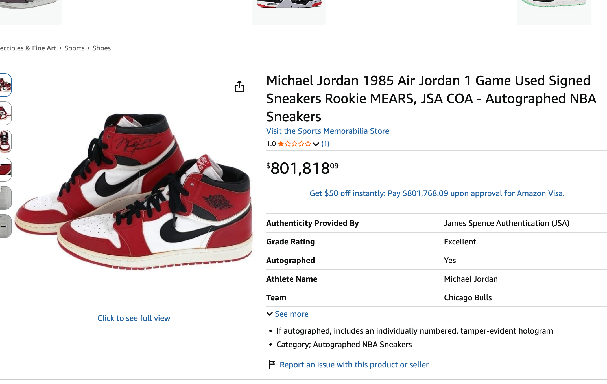

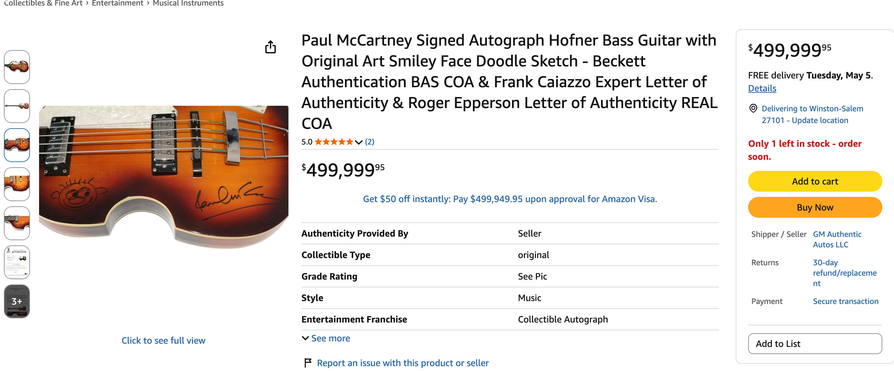

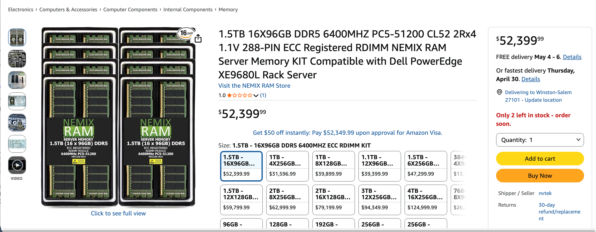

On the Reddit threads in the beginning someone mentioned the items and
we find some of them in our result like The Jordan shoes at \$801K, the
McCartney bass at \$500K, the Joe Jackson 1917 White Sox signed item at
\$400K.

## Part 5 Visualizing

### 5a. Linear-scale bar chart

``` r
products |>
  slice_head(n = 15) |>
  ggplot(aes(x = reorder(name_short, price), y = price, fill = department)) +
  geom_col() +
  coord_flip() +
  scale_y_continuous(labels = dollar_format()) +
  scale_fill_brewer(palette = "Set2") +
  labs(
    title    = "Amazon's Most Expensive Items (Linear Scale)",
    x = NULL, y = "Price (USD)", fill = "Department"
  ) +
  theme_minimal(base_size = 11) +
  theme(legend.position = "bottom")
```

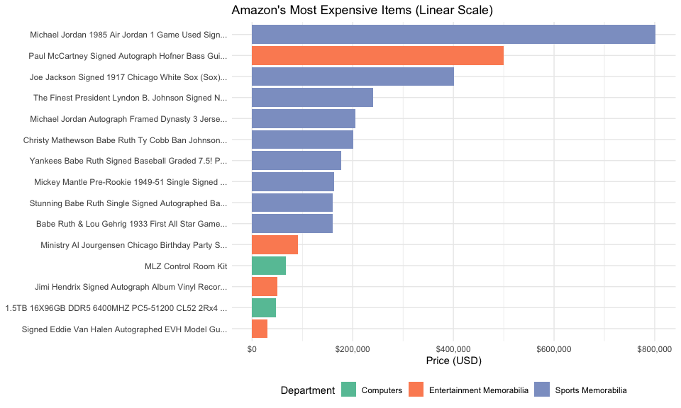<!-- -->

### 5b. Log-scale bar chart

Same data on a log10 axis so the cheaper-but-still-expensive items at
the bottom are actually visible.

``` r
products |>
  slice_head(n = 15) |>
  ggplot(aes(x = reorder(name_short, price), y = price, fill = department)) +
  geom_col() +
  coord_flip() +
  scale_y_log10(labels = dollar_format()) +
  scale_fill_brewer(palette = "Set2") +
  labs(
    title    = "Amazon's Most Expensive Items (Log10 Scale)",
    x = NULL, y = "Price (USD, log10)", fill = "Department"
  ) +
  theme_minimal(base_size = 11) +
  theme(legend.position = "bottom")
```

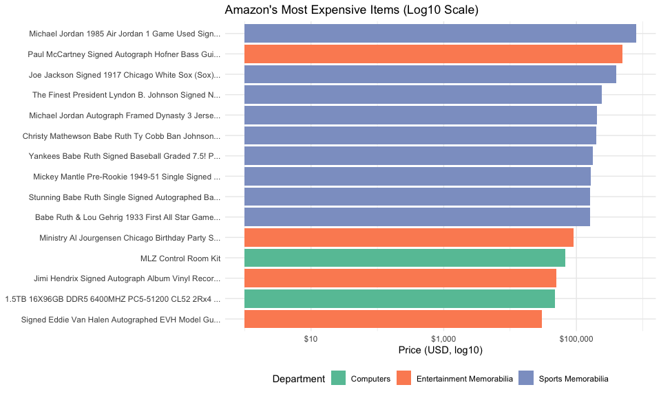<!-- -->

### 5c. Department-level summary

Which departments host the most expensive products in absolute terms?
Boxplot with a log y-axis:

``` r
products |>
  ggplot(aes(x = reorder(department, price, FUN = median),
             y = price, fill = department)) +
  geom_boxplot(alpha = 0.7, outlier.shape = NA) +
  geom_jitter(width = 0.15, alpha = 0.6, size = 1.5) +
  coord_flip() +
  scale_y_log10(labels = dollar_format()) +
  scale_fill_brewer(palette = "Set2", guide = "none") +
  labs(
    title    = "Price Distribution by Amazon Department",
    x = NULL, y = "Price (USD, log10)"
  ) +
  theme_minimal(base_size = 11)
```

    ## Warning in RColorBrewer::brewer.pal(n, pal): n too large, allowed maximum for palette Set2 is 8
    ## Returning the palette you asked for with that many colors

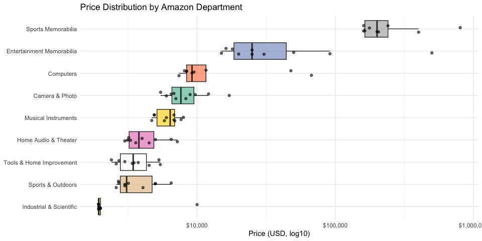<!-- -->

``` r
products |>
  group_by(department) |>
  summarise(
    n            = n(),
    median_price = median(price),
    max_price    = max(price),
    top_product  = name_short[which.max(price)],
    .groups      = "drop"
  ) |>
  arrange(desc(max_price)) |>
  mutate(median_price = dollar(median_price),
         max_price    = dollar(max_price)) |>
  kable()
```

| department | n | median_price | max_price | top_product |
|:---|---:|:---|:---|:---|
| Sports Memorabilia | 9 | \$200,457 | \$801,818 | Michael Jordan 1985 Air Jordan 1 Game Used Sign… |
| Entertainment Memorabilia | 10 | \$25,000 | \$500,000 | Paul McCartney Signed Autograph Hofner Bass Gui… |
| Computers | 9 | \$9,192 | \$67,222 | MLZ Control Room Kit |
| Camera & Photo | 10 | \$7,662 | \$17,100 | Leica M11-P Rangefinder Camera (Silver) (202-14… |
| Industrial & Scientific | 8 | \$1,941 | \$9,999 | Bread Mac & Cheese, Microwave Meal, Vegetarian,… |
| Musical Instruments | 10 | \$6,398 | \$7,970 | MOKA SFX 12x12FT Magnetic LED Dance Floor Panel… |
| Home Audio & Theater | 10 | \$3,800 | \$7,199 | Denon AVR-A1H 15.4 Channel 8K Receiver Bundle w… |
| Sports & Outdoors | 10 | \$3,092 | \$6,500 | Stratos Micro RTX 5090 32GB, 24-Core Intel Ultr… |
| Tools & Home Improvement | 10 | \$3,448 | \$5,422 | Jet 12-Inch Continuous Variable-Speed Band Saw,… |

## Some Note…

But the catalog still **doesn’t** include the specific \$284K T206
baseball card set from the very first screenshot of this portfolio. I
think they maybe in the Sports Memorabilia…  I asked Claude
for help and it said “That listing presumably sits in an even narrower
Sports Memorabilia sub-node (probably”Trading Cards \> Baseball”
specifically) that price-desc-rank on the parent node didn’t surface, or
it was below page 1 of the parent listing because Amazon’s ranking
penalizes low-review-count listings.” So that’s the reason why we not
get them first…

And also there still lots of other nodes, And Claude told me that
Amazon’s browse tree has thousands of leaf-level nodes. I did not try,
for example, something might be the house they mentioned on Reddit
threads. I find them by hand, and actually it’s under the node of
Patio,Lawn & Garden…(Why aren’t they in the outdoor section? What’s this
strange category? I’m confuse….) So it’s a new node..
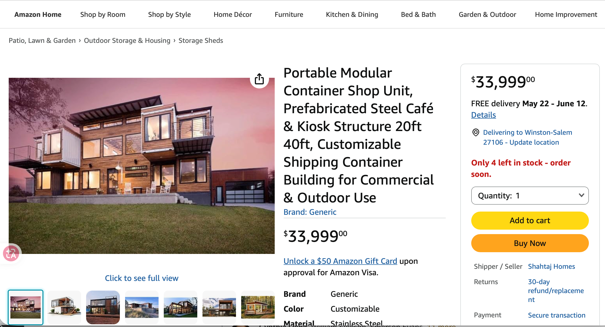 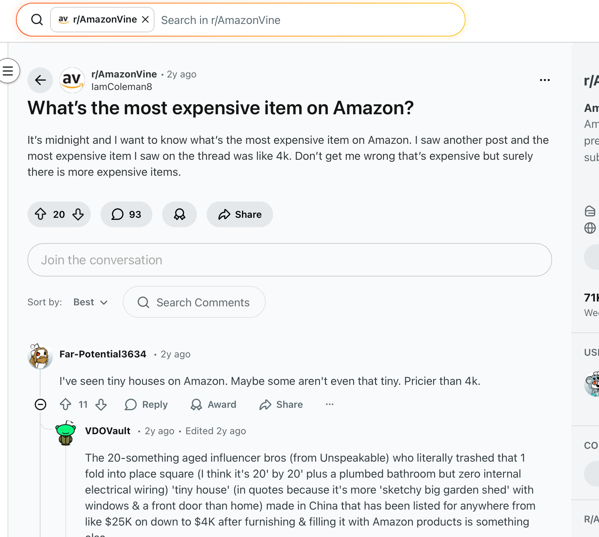 I was
actually planning to spend a bit more effort on this portfolio, I first
made this on the end of March, So I plan to make them improved on April,
but I didn’t expect this semester to end so quickly. :( This is a
portfolio I’m disappointed with because I think it could have been done
better.. and I feel I could found other ways to improve these results,
like try more potention Node or find some way to get a Amazon offical
API…..

But anyway, I really had a fun in this portfolio, and along the way, I
learned that data is the most valuable resource and also reviewed some
English vocabulary…….lol
