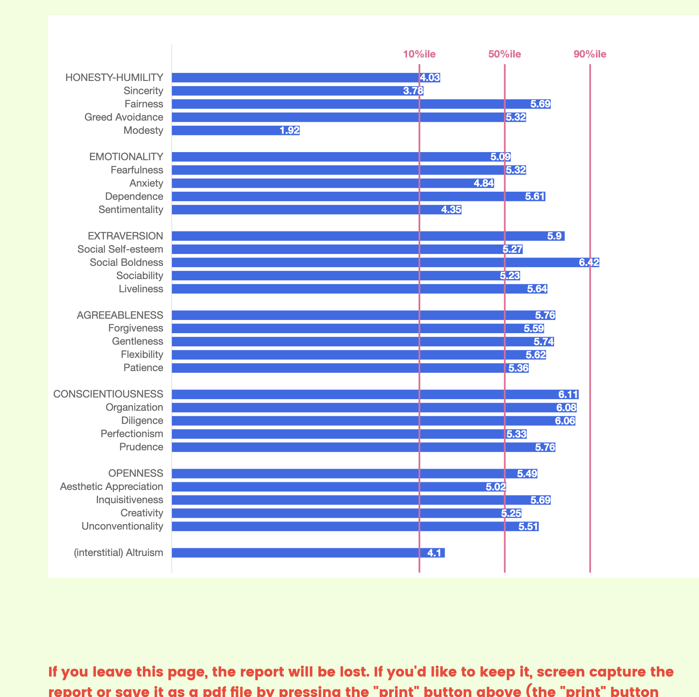
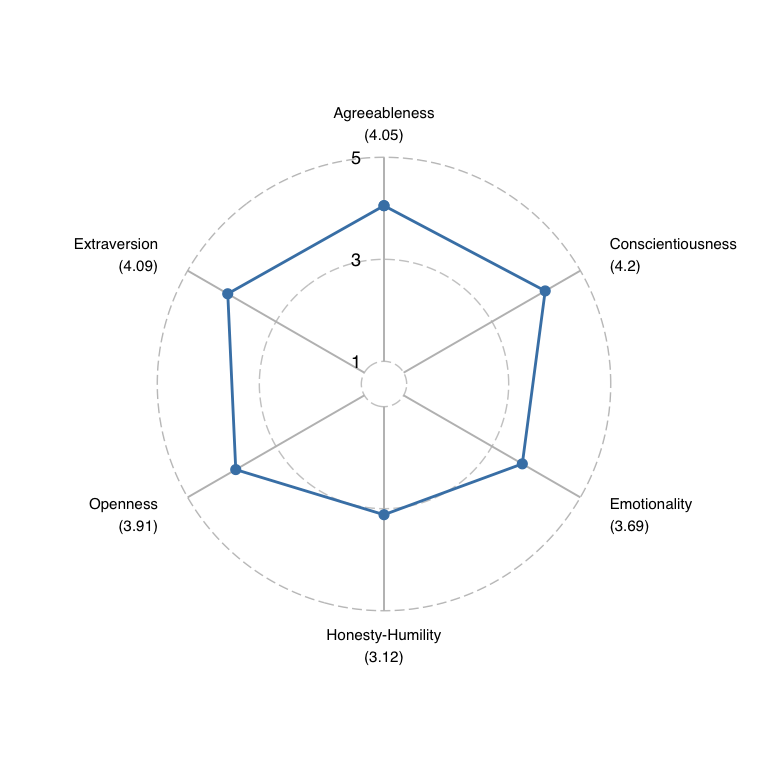
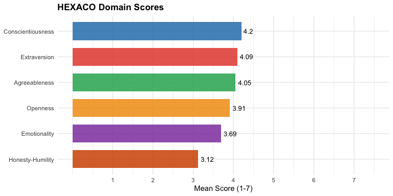
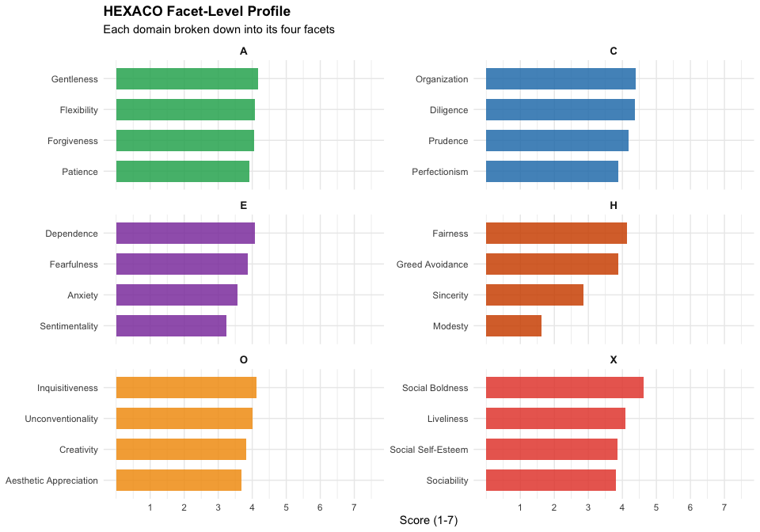
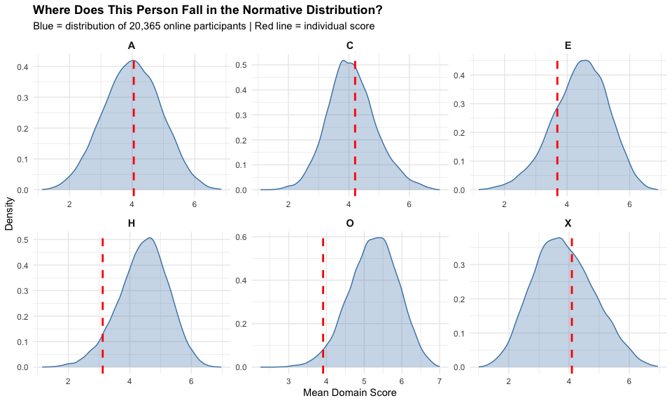
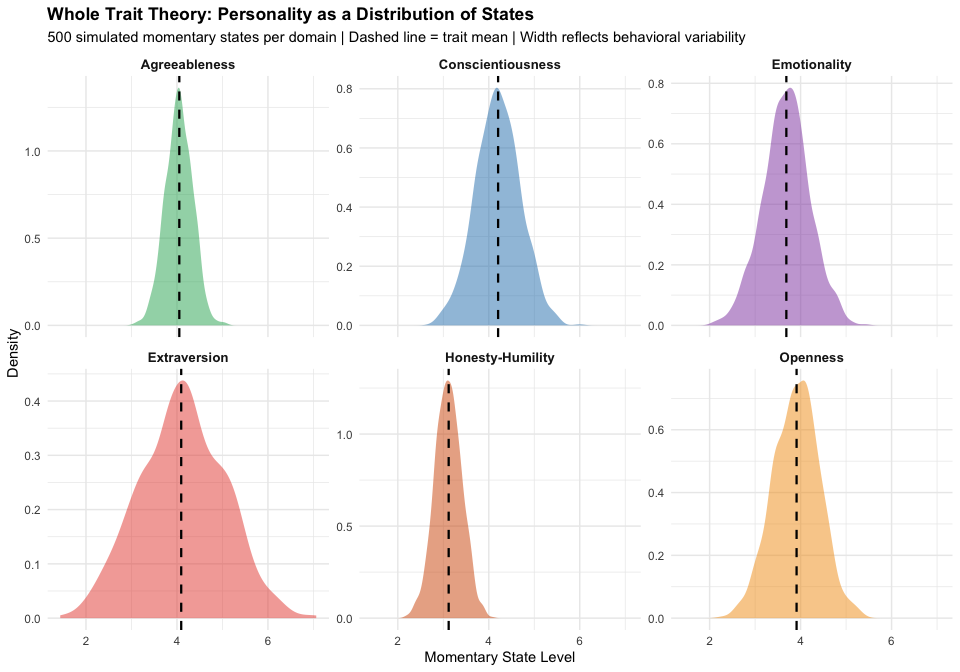
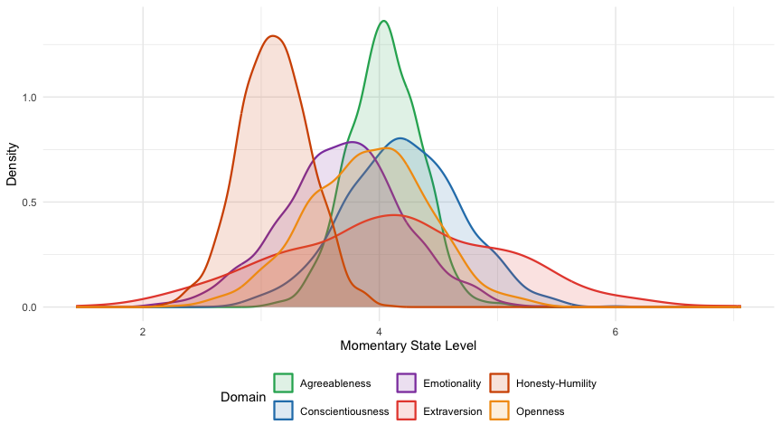

Visualizing HEXACO Personality Results in R
================

In personality psychology course, we spend a lot of time discussing the
HEXACO model (Honesty-Humility, Emotionality, Extraversion,
Agreeableness, Conscientiousness, Openness), each with four facets. Now
many websites offeres visualized personality tests, but there are
relatively few for HEXACO. One reason may be that compared with other
personality tests, HEXACO seems somewhat harder to understand.
Therefore, this portfolio aims to use R to visualze the HEXACO result.

## Portfolio Goals

- Build radar charts for HEXACO
- Explore where my personality falls in a normative distribution
- Simulate Whole Traits Theory

## Intro

### The HEXACO model

The HEXACO model (Ashton & Lee, 2004) + **H** (Honesty-Humility):
Sincerity, Fairness, Greed Avoidance, Modesty + **E** (Emotionality):
Fearfulness, Anxiety, Dependence, Sentimentality + **X** (Extraversion):
Social Self-Esteem, Social Boldness, Sociability, Liveliness + **A**
(Agreeableness): Forgiveness, Gentleness, Flexibility, Patience + **C**
(Conscientiousness): Organization, Diligence, Perfectionism, Prudence +
**O** (Openness): Aesthetic Appreciation, Inquisitiveness, Creativity,
Unconventionality

Each facet is measured by multiple items (the HEXACO-PI-R uses 10 items
per facet).

You can easily find more information [here](https://hexaco.org)

## Setup

``` r
library(tidyverse)
library(IPV)
```

For individual-level visualizations, I took the HEXACO-PI-R myself at
[hexaco.org](https://hexaco.org). For scale-level visualizations, I’ll
use the built-in HEXACO dataset from the IPV package (20,365
participants from the Open-Source Psychometrics Project). And you may
get a figure like this 
<span style="color: deepskyblue;"> **Commentsssssss:** This result
actually cost me a lot of extra time. When I first did the test, I only
saved the final scores, so I assumed the scale was 1–7 Likert. Later I
noticed something was wrong when I did the norm comparison part and
realized that my scores did not match the standard scoring format.<span>

<span style="color: deepskyblue;"> Since the website is quite
“official”, I initially assumed that must be correct. but why??? why the
questionnaire itself is 1–5, but the results it gave me were on a 1–7
scale. In the end, I tried other websites and found that everyone
provided percentiles, which made it even more difficult. So, I finally
had no choice but to convert this 7-point score into a 5-point scale for
analysis. <span>

I linearly converted my scores from 1–7 to 1–5 using:
`score_5 = 1 + (score_7 - 1) * (4/6)`.

``` r
my_profile <- tibble(
  domain = rep(c("H", "E", "X", "A", "C", "O"), each = 4),
  facet = c(
    "Sincerity", "Fairness", "Greed Avoidance", "Modesty",
    "Fearfulness", "Anxiety", "Dependence", "Sentimentality",
    "Social Self-Esteem", "Social Boldness", "Sociability", "Liveliness",
    "Forgiveness", "Gentleness", "Flexibility", "Patience",
    "Organization", "Diligence", "Perfectionism", "Prudence",
    "Aesthetic Appreciation", "Inquisitiveness", "Creativity", "Unconventionality"
  ),
  score_raw = c(
    3.78, 5.69, 5.32, 1.92,   # H (raw 1-7 from hexaco.org)
    5.32, 4.84, 5.61, 4.35,   # E
    5.27, 6.42, 5.23, 5.64,   # X
    5.59, 5.74, 5.62, 5.36,   # A
    6.08, 6.06, 5.33, 5.76,   # C
    5.02, 5.69, 5.25, 5.51    # O
  )
) %>%
  # Convert from 1-7 scale to 1-5 scale: score_5 = 1 + (score_7 - 1) * (4/6)
  mutate(score = 1 + (score_raw - 1) * (4 / 6))


# Domain-level means
domain_means <- my_profile %>%
  group_by(domain) %>%
  summarise(mean_score = mean(score), .groups = "drop") %>%
  mutate(domain_full = c("Agreeableness", "Conscientiousness", "Emotionality",
                          "Honesty-Humility", "Openness", "Extraversion"))

domain_means
```

    ## # A tibble: 6 × 3
    ##   domain mean_score domain_full      
    ##   <chr>       <dbl> <chr>            
    ## 1 A            4.05 Agreeableness    
    ## 2 C            4.20 Conscientiousness
    ## 3 E            3.69 Emotionality     
    ## 4 H            3.12 Honesty-Humility 
    ## 5 O            3.91 Openness         
    ## 6 X            4.09 Extraversion

## Radar Chart

Here we draw common radar charts in personality

``` r
library(ggradar)
library(scales)
```

I initially used ggplot for plotting, but ggplot doesn’t seem to perform
very well. Later, in github I discovered ggradar, which is an official
extension for ggplot2. `ggradar` expects a wide-format data frame where
the first column is a group label, and all remaining columns are numeric
variables. By default, it assumes values are scaled to \[0, 1\]. e.

``` r
# Prepare data
radar_data_wide <- domain_means %>%
  select(domain_full, mean_score) %>%
  mutate(group = "My HEXACO Profile") %>%
  pivot_wider(names_from = domain_full, values_from = mean_score) %>%
  select(group, everything())

# label
score_labels <- domain_means %>%
  mutate(label = paste0(domain_full, "\n(", round(mean_score, 2), ")")) %>%
  pull(label)
radar_data_scaled <- radar_data_wide %>%
  mutate(across(-group, ~ rescale(.x, from = c(1, 5))))

# Plot
ggradar(
  radar_data_scaled,
  values.radar = c("1", "3", "5"),
  axis.labels = score_labels,
  axis.label.size = 4,
  group.line.width = 1,
  group.point.size = 3,
  group.colours = "steelblue",
  background.circle.colour = "white",
  gridline.mid.colour = "grey",
  plot.legend = FALSE
)
```

<!-- -->

## Bar Charts (The Serious Version)

For actual reporting, bar charts with facet-level detail are more
informative and harder to misinterpret. Also since personality is so
diverse that I’ve chosen some lively colors here.

### Domain-level

``` r
ggplot(domain_means, aes(x = reorder(domain_full, mean_score), y = mean_score, 
                          fill = domain)) +
  geom_col(width = 0.7, alpha = 0.85) +
  geom_text(aes(label = round(mean_score, 2)), hjust = -0.2, size = 3.5) +
  coord_flip() +
  scale_y_continuous(limits = c(0, 7.5), breaks = 1:7) +
  scale_fill_manual(values = c(
    "A" = "#27AE60", "C" = "#2980B9", "E" = "#8E44AD",
    "H" = "#D35400", "O" = "#F39C12", "X" = "#E74C3C"
  )) +
  labs(title = "HEXACO Domain Scores", x = NULL, y = "Mean Score (1-7)") +
  theme_minimal() +
  theme(legend.position = "none",
        plot.title = element_text(face = "bold"))
```

<!-- -->

### Facet-level

In Dr.Fleeson’s class this semaster we discuss the hierarchy of
personality in our class, one important thing is that acutally
personality traits also have different levels, which make the whole
structure more stable. For instance, facet level difference can explain
why two people with the same Extraversion score can look very different
.

``` r
ggplot(my_profile, aes(x = reorder(facet, score), y = score, fill = domain)) +
  geom_col(width = 0.7, alpha = 0.85) +
  coord_flip() +
  facet_wrap(~ domain, scales = "free_y", ncol = 2) +
  scale_y_continuous(limits = c(0, 7.5), breaks = 1:7) +
  scale_fill_manual(values = c(
    "A" = "#27AE60", "C" = "#2980B9", "E" = "#8E44AD",
    "H" = "#D35400", "O" = "#F39C12", "X" = "#E74C3C"
  )) +
  labs(title = "HEXACO Facet-Level Profile",
       subtitle = "Each domain broken down into its four facets",
       x = NULL, y = "Score (1-7)") +
  theme_minimal() +
  theme(legend.position = "none",
        plot.title = element_text(face = "bold"),
        strip.text = element_text(face = "bold", size = 10))
```

<!-- -->

## Personality Distribution

On many MBTI websites, personality results are often presented in a
categorical way. For example, after being classified as an ENTJ, you may
see lists of famous pepople who are also labeled as ENTJ. This type of
presentation implicitly assumes that personality traits are dichotomous
categories, where individuals belong clearly to one type rather than
another. However, what we learned this semaster in personality class
claim that traits as continuous dimensions rather than discrete
categories. Individuals vary in the degree to which they possess certain
characteristics, and these differences are better represented along
continuous distributions (ALso as I said many HEXACO website only offer
percentiles). So what we do here is to find where “my personality” fall
in the distribution

### About the normative data

The normative distribution here comes from the `HEXACO` dataset built
into the `IPV` package. This dataset contains responses from **20,365
participants** who completed the 240-item HEXACO-PI-R through the
[Open-Source Psychometrics Project](https://openpsychometrics.org/).

<span style="color: deepskyblue;">Note: Strictly speaking this is not an
absolute population norm. Becasue this is an **online convenience
sample**, not a representative population sample. And people who
voluntarily take personality tests online may differ systematically from
the general population (e.g., higher Openness, younger age).<span>

``` r
norm_data <- tibble(
  H = rowMeans(HEXACO[, grep("^H", names(HEXACO))], na.rm = TRUE),
  E = rowMeans(HEXACO[, grep("^E", names(HEXACO))], na.rm = TRUE),
  X = rowMeans(HEXACO[, grep("^X", names(HEXACO))], na.rm = TRUE),
  A = rowMeans(HEXACO[, grep("^A", names(HEXACO))], na.rm = TRUE),
  C = rowMeans(HEXACO[, grep("^C", names(HEXACO))], na.rm = TRUE),
  O = rowMeans(HEXACO[, grep("^O", names(HEXACO))], na.rm = TRUE)
)
norm_long <- norm_data %>%
  pivot_longer(everything(), names_to = "domain", values_to = "score")

my_scores <- domain_means %>% select(domain, mean_score)

# Plot
ggplot(norm_long, aes(x = score)) +
  geom_density(fill = "steelblue", alpha = 0.3, color = "steelblue") +
  geom_vline(data = my_scores, aes(xintercept = mean_score), 
             color = "red", linewidth = 1, linetype = "dashed") +
  facet_wrap(~ domain, scales = "free", ncol = 3) +
  labs(title = "Where Does This Person Fall in the Normative Distribution?",
       subtitle = "Blue = distribution of 20,365 online participants | Red line = individual score",
       x = "Mean Domain Score", y = "Density") +
  theme_minimal() +
  theme(plot.title = element_text(face = "bold"),
        strip.text = element_text(face = "bold", size = 11))
```

<!-- -->

## Whole Trait Theory

### The Whole Trait Theory (WTT)

In Dr. Fleeson class anthoer important theory we learn is about the
Whole Trait Theory proposed by him in 2015. which offers an integrative
framework that bridges two perspectives in personality psychology:
**traits** and **states**.

The core idea is straightforward: a personality trait is not a single
fixed point, but a **distribution of states over time**. In any moment,
you might behave more or less extraverted depending on the situation.
For instance, at a party or studying alone, OR with close friends or
strangers. If we recorded our moment-to-moment extraversion over weeks
or months, those momentary states would form a distribution. The
**mean** of that distribution corresponds to what we traditionally call
your “trait level,” but there is still **variance** which means our
behavior fluctuates across situations.

### Simulating personality states

So here we use the `rnorm()` function we’ve used in Module 13. And
reflecting my self:

- **Extraversion (X)**: I feel like my extraversion fluctuates a lot.
  **large SD**.
- **Honesty-Humility (H) and Agreeableness (A)**: These is much pretty
  stable for me. **Small SD**.
- **Emotionality (E), Conscientiousness (C), Openness (O)**: Nothing
  special. **Medium SD**.

``` r
set.seed(42)
n_moments <- 1000  


trait_means <- domain_means %>% select(domain, domain_full, mean_score)


trait_sds <- tibble(
  domain = c("A", "C", "E", "H", "O", "X"),
  sd = c(0.3, 0.5, 0.5, 0.3, 0.5, 0.9))  

# Simulate states
sim_states <- trait_means %>%
  left_join(trait_sds, by = "domain") %>%
  rowwise() %>%
  mutate(states = list(rnorm(n_moments, mean = mean_score, sd = sd))) %>%
  unnest(states)

# Density plot of simulated states
ggplot(sim_states, aes(x = states, fill = domain)) +
  geom_density(alpha = 0.5, color = NA) +
  geom_vline(data = trait_means, aes(xintercept = mean_score), 
             linetype = "dashed", linewidth = 0.8, color = "black") +
  facet_wrap(~ domain_full, scales = "free_y", ncol = 3) +
  scale_fill_manual(values = c(
    "A" = "#27AE60", "C" = "#2980B9", "E" = "#8E44AD",
    "H" = "#D35400", "O" = "#F39C12", "X" = "#E74C3C"
  )) +
  labs(title = "Whole Trait Theory: Personality as a Distribution of States",
       subtitle = paste0("500 simulated momentary states per domain | ",
                         "Dashed line = trait mean | Width reflects behavioral variability"),
       x = "Momentary State Level", y = "Density") +
  theme_minimal() +
  theme(legend.position = "none",
        plot.title = element_text(face = "bold"),
        strip.text = element_text(face = "bold", size = 10))
```

<!-- -->

We can also put all six domains on a single plot:

``` r
ggplot(sim_states, aes(x = states, fill = domain_full, color = domain_full)) +
  geom_density(alpha = 0.15, linewidth = 0.8) +
  scale_fill_manual(values = c(
    "Agreeableness" = "#27AE60", "Conscientiousness" = "#2980B9", 
    "Emotionality" = "#8E44AD", "Honesty-Humility" = "#D35400", 
    "Openness" = "#F39C12", "Extraversion" = "#E74C3C"
  )) +
  scale_color_manual(values = c(
    "Agreeableness" = "#27AE60", "Conscientiousness" = "#2980B9", 
    "Emotionality" = "#8E44AD", "Honesty-Humility" = "#D35400", 
    "Openness" = "#F39C12", "Extraversion" = "#E74C3C"
  )) +
  labs(x = "Momentary State Level", y = "Density",
       fill = "Domain", color = "Domain") +
  theme_minimal() +
  theme(plot.title = element_text(face = "bold"),
        legend.position = "bottom")
```

<!-- -->

…this chart looks a bit messy. Anyway since it’s already made, still
display it here.
